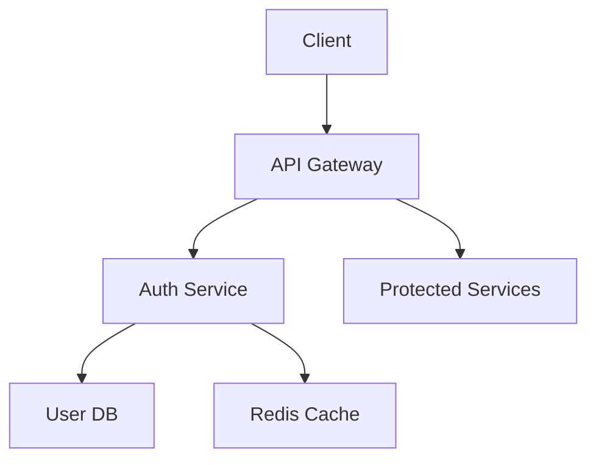

# 사용자 인증 시스템 설계 문서

**작성일**: 2025-08-13
**작성자**: Gemini-Claude 협업
**버전**: v1.0

## 개요
웹 애플리케이션의 사용자 인증 및 권한 관리 시스템 설계

## 요구사항
### 기능적 요구사항
- [ ] 사용자 회원가입 (이메일/패스워드)
- [ ] 사용자 로그인/로그아웃
- [ ] JWT 토큰 기반 인증
- [ ] 비밀번호 재설정 기능
- [ ] 역할 기반 권한 관리 (RBAC)

### 비기능적 요구사항
- **성능**: 인증 처리 < 100ms
- **보안**: OWASP 보안 가이드라인 준수
- **확장성**: 10만 동시 사용자 지원
- **가용성**: 99.9% 업타임

## 시스템 아키텍처



## 상세 설계

### 데이터 모델
```
User Entity:
- id: UUID (Primary Key)
- email: String (Unique)
- password_hash: String (bcrypt)
- role: Enum (user, admin, moderator)
- created_at: DateTime
- updated_at: DateTime
- is_active: Boolean
```

### API 설계
#### POST /api/auth/register
**요청**:
```json
{
  "email": "user@example.com",
  "password": "securePassword123"
}
```

**응답**:
```json
{
  "user_id": "uuid",
  "email": "user@example.com",
  "access_token": "jwt_token",
  "refresh_token": "refresh_token"
}
```

#### POST /api/auth/login
**요청**:
```json
{
  "email": "user@example.com", 
  "password": "securePassword123"
}
```

**응답**:
```json
{
  "user_id": "uuid",
  "access_token": "jwt_token",
  "refresh_token": "refresh_token",
  "expires_in": 3600
}
```

### 주요 알고리즘/로직
1. **패스워드 해싱**: bcrypt (cost=12)
2. **JWT 토큰**: 1시간 만료, RS256 알고리즘
3. **Refresh 토큰**: 30일 만료, 일회용
4. **Rate Limiting**: IP당 분당 5회 로그인 시도 제한

## 구현 계획
1. [ ] 1단계: User 모델 및 DB 스키마 구현
2. [ ] 2단계: 회원가입/로그인 API 구현  
3. [ ] 3단계: JWT 토큰 발급/검증 로직 구현
4. [ ] 4단계: 권한 관리 미들웨어 구현
5. [ ] 5단계: 보안 강화 (Rate Limiting, 입력 검증)

## 테스트 전략
- **단위 테스트**: 각 인증 함수 개별 테스트
- **통합 테스트**: API 엔드포인트 전체 플로우 테스트
- **보안 테스트**: SQL Injection, XSS 등 취약점 테스트
- **성능 테스트**: 동시 사용자 부하 테스트

## 보안 고려사항
- 패스워드 복잡성 요구사항 강제
- HTTPS 필수 사용
- JWT 토큰 안전한 저장 (httpOnly 쿠키)
- CSRF 토큰 사용
- 로그인 시도 로깅 및 모니터링

## 참고 자료
- [ADR-002: JWT vs Session 선택](../adr/ADR-002-jwt-vs-session.md)
- [OWASP Authentication Cheat Sheet](https://cheatsheetseries.owasp.org/cheatsheets/Authentication_Cheat_Sheet.html)