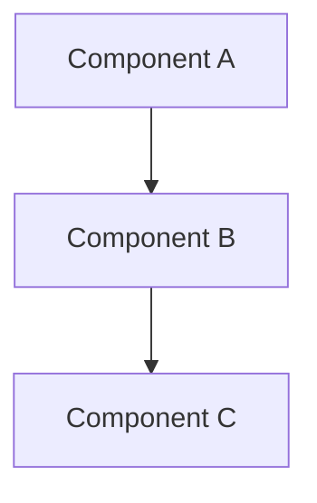

# [기능/시스템명] 설계 문서

**작성일**: YYYY-MM-DD
**작성자**: [작성자]
**버전**: v1.0

## 개요
*이 설계가 다루는 기능이나 시스템에 대한 간단한 설명*

## 요구사항
### 기능적 요구사항
- [ ] 요구사항 1
- [ ] 요구사항 2
- [ ] 요구사항 3

### 비기능적 요구사항
- **성능**: 
- **보안**: 
- **확장성**: 
- **가용성**: 

## 시스템 아키텍처
*전체적인 시스템 구조 설명*



## 상세 설계

### 데이터 모델
```
Entity: [엔티티명]
- field1: type (설명)
- field2: type (설명)
```

### API 설계
#### POST /api/endpoint
**요청**:
```json
{
  "field": "value"
}
```

**응답**:
```json
{
  "result": "value"
}
```

### 주요 알고리즘/로직
*핵심 비즈니스 로직이나 알고리즘 설명*

## 구현 계획
1. [ ] 1단계: 기본 구조 구현
2. [ ] 2단계: 핵심 기능 구현  
3. [ ] 3단계: 테스트 및 최적화

## 테스트 전략
- **단위 테스트**: 
- **통합 테스트**: 
- **성능 테스트**: 

## 배포 계획
*배포 방법과 롤백 계획*

## 모니터링
*주요 지표와 모니터링 방법*

## 참고 자료
- [관련 ADR]
- [외부 문서]