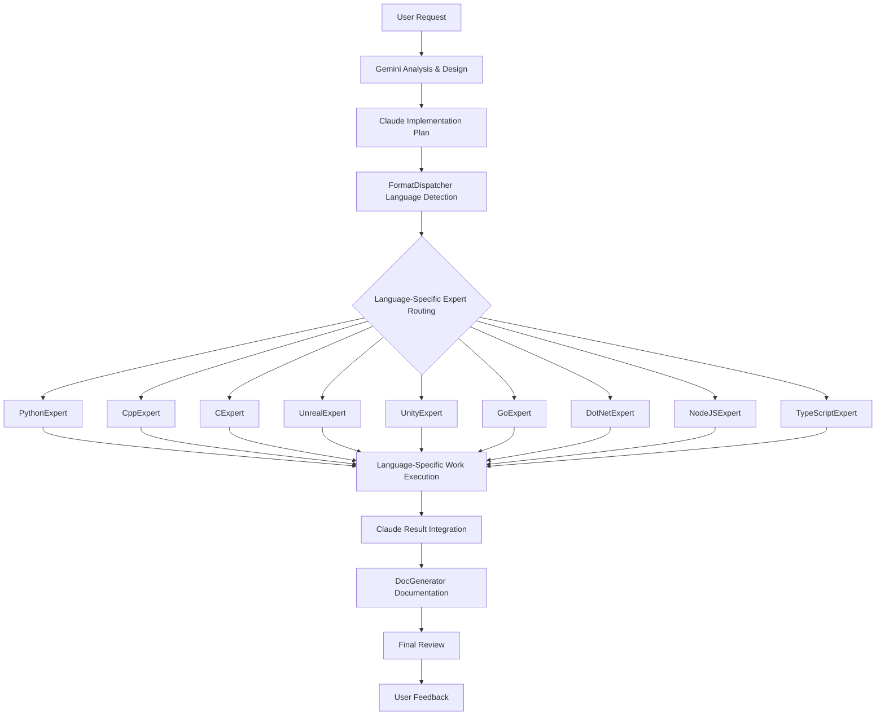

# Claude Code Subagents Utilization Guide

## Overview
This document defines strategies for maximizing efficiency in user-centered collaboration models using Claude Code's subagents system.

## Subagents Introduction Roadmap

### 🚀 Phase 1: Immediate Implementation (Current)

#### 1. DocGenerator (Documentation Generator)
**Role**: Automatic generation and updating of project documentation
**Reason for Introduction**: Maximize efficiency through parallel processing, automate knowledge preservation

**Scope 1 Coverage:**
- Structuring and maintaining consistency of `.kb/` documentation
- Automatic updates of `README.md`, `PROJECT_GUIDE.md`
- Template application for ADRs and design documents
- Session log organization and summarization
- Integrated management of multi-language project documentation

**Trigger Conditions:**
- Upon completion of new features
- When important decisions occur
- Upon explicit user request
- During weekly documentation organization

#### 2. Language-Specific Expert Developers (Expanded Role)
**Role**: Perform development, refactoring, optimization, and debugging specialized for each language
**Reason for Introduction**: Maximize language-specific expertise, implement hierarchical agent model

**Applying Gemini's Hierarchical Agent Model:**
- **L1: Gemini (Project Manager)** - Project analysis, architecture design
- **L2: Claude (Expert Implementer)** - Complex logic implementation, agent coordination
- **L3: Language Experts (Specialized Tools)** - Language-specific expert work

**Language-Specific Expert Agents (9 total):**
- **FormatDispatcher**: Intelligent routing and workflow coordination
- **PythonExpert**: Python development, PEP8, type hints, performance optimization
- **CppExpert**: C++ development, memory management, STL utilization, performance optimization
- **CExpert**: C development, system programming, memory safety, POSIX compatibility
- **UnrealExpert**: UE C++ development, Blueprint integration, game optimization
- **UnityExpert**: Unity C# development, MonoBehaviour patterns, mobile optimization
- **GoExpert**: Go development, concurrency patterns, microservice architecture
- **DotNetExpert**: .NET development, modern C# patterns, enterprise architecture
- **NodeJSExpert**: Node.js backend development, asynchronous patterns, API design
- **TypeScriptExpert**: TypeScript development, advanced type system, compiler optimization

**Expanded Role Scope:**
1. **Code Writing**: Implementation of new features, classes, modules
2. **Refactoring**: Code improvement applying language-specific best practices
3. **Bug Fixing**: Language-specific debugging and problem solving
4. **Performance Optimization**: Application of language-specific performance patterns
5. **Test Writing**: Utilization of language-specific test frameworks
6. **Code Quality**: Formatting, linting, static analysis

**Trigger Conditions:**
- Explicit calls from Claude Code (L2 → L3)
- When language-specific expert work is needed
- When solving complex language-specific problems

#### 3. general-purpose (General-Purpose Analyzer)
**Role**: Complex search and multi-step analysis tasks
**Reason for Introduction**: Already available, complements Gemini

**Coverage:**
- Large codebase pattern searches
- Dependency analysis and impact assessment
- Complex refactoring plan development
- Performance bottleneck analysis

### ⚡ Phase 2: Short-term Implementation (1-2 weeks later)

#### 4. TestGenerator (Test Generator)
**Role**: Automatic test code generation
**Prerequisites**: Existence of stabilized modules

**Coverage:**
- Automatic unit test generation
- Integration test scenario writing
- Edge case test generation
- Test coverage analysis

#### 5. DocGenerator (Expansion)
**Role**: Code documentation automation
**Scope 2 Coverage:**
- **Python**: docstring, type hints, sphinx documentation
- **C++**: Doxygen comments, header documentation
- **Unreal C++**: UCLASS/UFUNCTION metadata, Blueprint guides
- **Unity C#**: MonoBehaviour, Inspector descriptions, ScriptableObject documentation
- **Go**: godoc format, Example functions, package documentation
- **C# .NET**: XML documentation comments, API documentation, DocFX generation

### 🔒 Phase 3: Medium-term Implementation (1 month later)

#### 6. SecurityAuditor (Security Auditor)
**Role**: Automatic security vulnerability inspection
**Coverage:**
- Common security vulnerability scanning
- Sensitive information exposure checking
- Dependency security inspection
- Security best practices compliance

## Subagents Coordination Strategy

### 1. Hierarchical Agent Collaboration Workflow



### 2. Conflict Prevention Mechanisms

#### Language-Specific Resource Separation
- **FormatDispatcher**: Project analysis, routing only
- **PythonExpert**: `*.py`, `requirements.txt`, `pyproject.toml`, `setup.py`
- **CppExpert**: `*.cpp`, `*.hpp`, `*.h`, `CMakeLists.txt`, `Makefile`
- **CExpert**: `*.c`, `*.h`, `Makefile`, `configure.ac`
- **UnrealExpert**: `Source/*.cpp`, `*.uproject`, `Config/`, `Content/`
- **UnityExpert**: `Assets/Scripts/*.cs`, `ProjectSettings/`, `*.unity`
- **GoExpert**: `*.go`, `go.mod`, `go.sum`
- **DotNetExpert**: `*.cs` (non-Unity), `*.csproj`, `*.sln`, `global.json`
- **NodeJSExpert**: `*.js`, `*.mjs`, `package.json`, `*.json`
- **TypeScriptExpert**: `*.ts`, `*.tsx`, `tsconfig.json`, `*.d.ts`
- **MySQLExpert**: `*.sql`, `schema.sql`, `migrations/`, MySQL configuration
- **RedisExpert**: `redis.conf`, cache scripts, Lua scripts
- **PostgreSQLExpert**: `*.sql`, PostgreSQL configuration, functions/triggers
- **MongoDBExpert**: `*.js` (mongo scripts), schema definitions, aggregation pipelines
- **SQLiteExpert**: `*.sqlite`, `*.db`, embedded DB scripts
- **SpreadsheetExpert**: `*.xlsx`, `*.csv`, Google Sheets configuration, data transformation scripts
- **DocGenerator**: `.md` files, code comments (all languages, DBs, data sources)

#### Hierarchical Work Order
1. **L1 Analysis**: Gemini analyzes requirements and designs architecture
2. **L2 Planning**: Claude develops implementation strategy and language expert call plan
3. **L3 Execution**: FormatDispatcher detects language then assigns work to experts
4. **Parallel/Sequential Execution**: Independent work in parallel, dependent work sequentially
5. **L2 Integration**: Claude reviews and integrates all results
6. **Documentation**: DocGenerator creates integrated documentation
7. **Final Review**: User feedback and approval

### 3. Result Reporting System

#### Expanded Gemini Role: Orchestrator
- Coordinate all subagent activities
- Integrate and summarize results
- Propose resolution when conflicts occur
- Provide concise final reports to users

#### Reporting Format
```markdown
## Work Completion Report

### Implementation Results
- ✅ Main feature implementation completed
- ✅ Linter: 5 files style corrected
- ✅ DocGenerator: README.md updated

### Issues Discovered
- ⚠️ general-purpose: 3 performance optimization points found

### Next Steps Suggested
- [ ] Performance optimization review
- [ ] Additional test case writing
```

## Usage Guide

### 1. Basic Usage
```bash
# Single subagent call
claude --agent=DocGenerator "Please update the README file"

# Multiple subagent parallel execution (coordinated by Claude)
claude --parallel "Implement new feature then document and style check"
```

### 2. Integration with Gemini
```bash
# Gemini directing subagent work
echo "Analyze implemented code, document with DocGenerator, and style check with Linter" | gemini
```

### 3. Automation Setup
```bash
# Pre-commit automation (git hook)
pre-commit: Linter
post-merge: DocGenerator + TestGenerator
```

## Monitoring and Quality Management

### Success Metrics
- **Efficiency**: 30% reduction in total work time
- **Quality**: Documentation consistency 95% or higher
- **User Satisfaction**: 4.5 points or higher (out of 5)

### Regular Review (Weekly)
- [ ] Subagent performance analysis
- [ ] Check conflict occurrence frequency
- [ ] Collect user feedback
- [ ] Derive workflow improvements

### Upgrade Criteria
- Review items when adding new subagents:
  1. Clear responsibility scope definition
  2. No conflicts with existing subagents
  3. Clear user value
  4. Testing and validation completed

---

**This guide is continuously updated as the project evolves.**