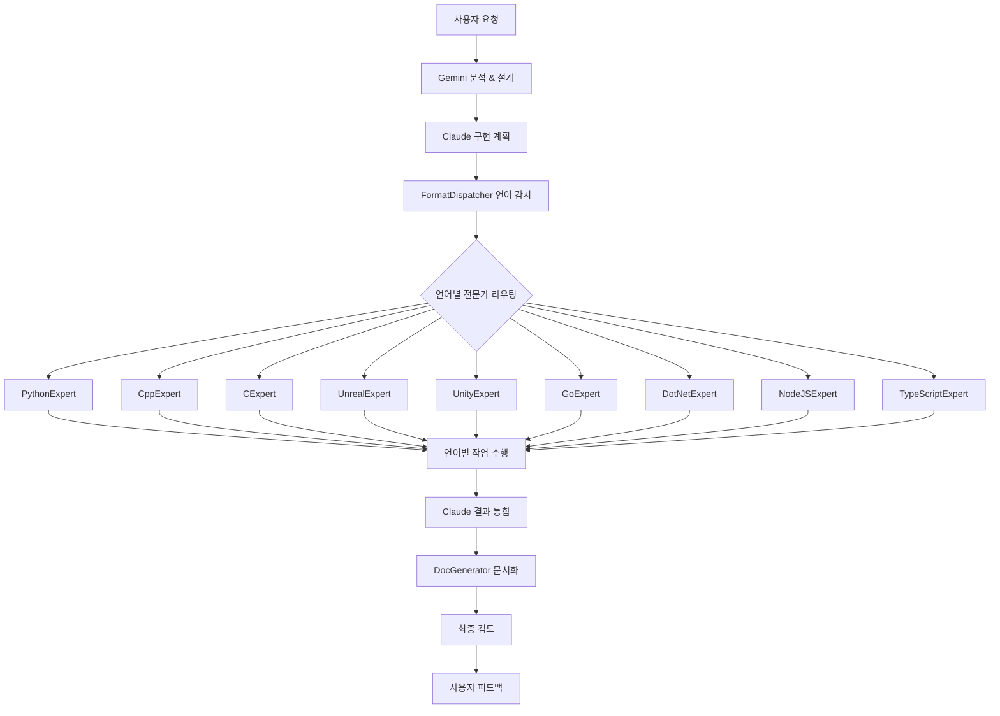

# Claude Code Subagents 활용 가이드

## 개요
Claude Code의 subagents 시스템을 활용하여 사용자 중심 협업 모델에서 효율성을 극대화하는 전략을 정의합니다.

## Subagents 도입 로드맵

### 🚀 Phase 1: 즉시 도입 (현재)

#### 1. DocGenerator (문서 생성기)
**역할**: 프로젝트 문서 자동 생성 및 업데이트
**도입 이유**: 병렬 처리로 효율성 극대화, 지식 보존 자동화

**활용 범위 (Scope 1):**
- `.kb/` 문서 구조화 및 일관성 유지
- `README.md`, `PROJECT_GUIDE.md` 자동 업데이트  
- ADR, 설계 문서 템플릿 적용
- 세션 로그 정리 및 요약
- 다중 언어 프로젝트 문서 통합 관리

**트리거 조건:**
- 새로운 기능 완료 시
- 중요한 결정 사항 발생 시
- 사용자 명시적 요청 시
- 주간 문서 정리 시

#### 2. 언어별 전문 개발자 (확장된 역할)
**역할**: 각 언어에 특화된 개발, 리팩토링, 최적화, 디버깅 수행
**도입 이유**: 언어별 전문성 극대화, 계층적 에이전트 모델 구현

**Gemini의 계층적 에이전트 모델 적용:**
- **L1: Gemini (Project Manager)** - 프로젝트 분석, 아키텍처 설계
- **L2: Claude (Expert Implementer)** - 복합 로직 구현, 에이전트 조율
- **L3: Language Experts (Specialized Tools)** - 언어별 전문 작업 수행

**언어별 전문 에이전트 (9개):**
- **FormatDispatcher**: 지능적 라우팅 및 워크플로우 조율
- **PythonExpert**: Python 개발, PEP8, 타입 힌트, 성능 최적화
- **CppExpert**: C++ 개발, 메모리 관리, STL 활용, 성능 최적화
- **CExpert**: C 개발, 시스템 프로그래밍, 메모리 안전성, POSIX 호환
- **UnrealExpert**: UE C++ 개발, Blueprint 연동, 게임 최적화
- **UnityExpert**: Unity C# 개발, MonoBehaviour 패턴, 모바일 최적화
- **GoExpert**: Go 개발, 동시성 패턴, 마이크로서비스 아키텍처
- **DotNetExpert**: .NET 개발, 현대적 C# 패턴, 엔터프라이즈 아키텍처
- **NodeJSExpert**: Node.js 백엔드 개발, 비동기 패턴, API 설계
- **TypeScriptExpert**: TypeScript 개발, 고급 타입 시스템, 컴파일러 최적화

**확장된 역할 범위:**
1. **코드 작성**: 새로운 기능, 클래스, 모듈 구현
2. **리팩토링**: 언어별 모범 사례 적용한 코드 개선
3. **버그 수정**: 언어 특화 디버깅 및 문제 해결
4. **성능 최적화**: 언어별 성능 패턴 적용
5. **테스트 작성**: 언어별 테스트 프레임워크 활용
6. **코드 품질**: 포매팅, 린팅, 정적 분석

**트리거 조건:**
- Claude Code의 명시적 호출 (L2 → L3)
- 언어별 전문 작업 필요 시
- 복잡한 언어 특화 문제 해결 시

#### 3. general-purpose (범용 분석기)
**역할**: 복잡한 검색 및 다단계 분석 작업
**도입 이유**: 이미 사용 가능, Gemini 보완

**활용 범위:**
- 대규모 코드베이스 패턴 검색
- 의존성 분석 및 영향도 평가
- 복잡한 리팩토링 계획 수립
- 성능 병목 지점 분석

### ⚡ Phase 2: 단기 도입 (1-2주 후)

#### 4. TestGenerator (테스트 생성기)
**역할**: 자동 테스트 코드 생성
**전제조건**: 안정화된 모듈 존재

**활용 범위:**
- 단위 테스트 자동 생성
- 통합 테스트 시나리오 작성
- 엣지 케이스 테스트 생성
- 테스트 커버리지 분석

#### 5. DocGenerator (확장)
**역할**: 코드 문서화 자동화
**활용 범위 (Scope 2):**
- **Python**: docstring, type hints, sphinx 문서
- **C++**: Doxygen 주석, 헤더 문서화
- **Unreal C++**: UCLASS/UFUNCTION 메타데이터, Blueprint 가이드
- **Unity C#**: MonoBehaviour, Inspector 설명, ScriptableObject 문서
- **Go**: godoc 형식, Example 함수, 패키지 문서
- **C# .NET**: XML 문서 주석, API 문서, DocFX 생성

### 🔒 Phase 3: 중기 도입 (1개월 후)

#### 6. SecurityAuditor (보안 감사기)
**역할**: 보안 취약점 자동 검사
**활용 범위:**
- 일반적인 보안 취약점 스캔
- 민감한 정보 노출 검사
- 의존성 보안 검사
- 보안 베스트 프랙티스 준수

## Subagents 조율 전략

### 1. 계층적 에이전트 협업 워크플로우



### 2. 충돌 방지 메커니즘

#### 언어별 리소스 분리
- **FormatDispatcher**: 프로젝트 분석, 라우팅만 담당
- **PythonExpert**: `*.py`, `requirements.txt`, `pyproject.toml`, `setup.py`
- **CppExpert**: `*.cpp`, `*.hpp`, `*.h`, `CMakeLists.txt`, `Makefile`
- **CExpert**: `*.c`, `*.h`, `Makefile`, `configure.ac`
- **UnrealExpert**: `Source/*.cpp`, `*.uproject`, `Config/`, `Content/`
- **UnityExpert**: `Assets/Scripts/*.cs`, `ProjectSettings/`, `*.unity`
- **GoExpert**: `*.go`, `go.mod`, `go.sum`
- **DotNetExpert**: `*.cs` (비Unity), `*.csproj`, `*.sln`, `global.json`
- **NodeJSExpert**: `*.js`, `*.mjs`, `package.json`, `*.json`
- **TypeScriptExpert**: `*.ts`, `*.tsx`, `tsconfig.json`, `*.d.ts`
- **MySQLExpert**: `*.sql`, `schema.sql`, `migrations/`, MySQL 설정
- **RedisExpert**: `redis.conf`, 캐시 스크립트, Lua 스크립트
- **PostgreSQLExpert**: `*.sql`, PostgreSQL 설정, 함수/트리거
- **MongoDBExpert**: `*.js` (몽고 스크립트), 스키마 정의, 집계 파이프라인
- **SQLiteExpert**: `*.sqlite`, `*.db`, 임베디드 DB 스크립트
- **SpreadsheetExpert**: `*.xlsx`, `*.csv`, 구글시트 설정, 데이터 변환 스크립트
- **DocGenerator**: `.md` 파일, 코드 주석 (모든 언어, DB, 데이터 소스)

#### 계층적 작업 순서
1. **L1 분석**: Gemini가 요구사항 분석 및 아키텍처 설계
2. **L2 계획**: Claude가 구현 전략 수립 및 언어 전문가 호출 계획
3. **L3 실행**: FormatDispatcher 언어 감지 후 전문가별 작업 할당
4. **병렬/순차 실행**: 독립적 작업은 병렬, 의존성 있는 작업은 순차
5. **L2 통합**: Claude가 모든 결과 검토 및 통합
6. **문서화**: DocGenerator가 통합 문서 생성
7. **최종 검토**: 사용자 피드백 및 승인

### 3. 결과 보고 체계

#### Gemini 역할 확장: Orchestrator
- 모든 subagent 활동 조율
- 결과 통합 및 요약 보고
- 충돌 발생 시 해결 방안 제시
- 사용자에게 간결한 최종 보고

#### 보고 형식
```markdown
## 작업 완료 보고

### 구현 결과
- ✅ 주요 기능 구현 완료
- ✅ Linter: 5개 파일 스타일 수정
- ✅ DocGenerator: README.md 업데이트

### 발견된 이슈
- ⚠️ general-purpose: 성능 최적화 포인트 3개 발견

### 다음 단계 제안
- [ ] 성능 최적화 검토
- [ ] 추가 테스트 케이스 작성
```

## 사용법 가이드

### 1. 기본 사용법
```bash
# 단일 subagent 호출
claude --agent=DocGenerator "README 파일을 업데이트해주세요"

# 여러 subagent 병렬 실행 (Claude가 조율)
claude --parallel "새 기능 구현 후 문서화 및 스타일 검사"
```

### 2. Gemini와 연계 사용
```bash
# Gemini가 subagent 작업 지시
echo "구현된 코드를 분석하고 DocGenerator로 문서화하고 Linter로 스타일 검사해주세요" | gemini
```

### 3. 자동화 설정
```bash
# 커밋 전 자동 실행 (git hook)
pre-commit: Linter
post-merge: DocGenerator + TestGenerator
```

## 모니터링 및 품질 관리

### 성공 지표
- **효율성**: 전체 작업 시간 30% 단축
- **품질**: 문서 일관성 95% 이상
- **사용자 만족도**: 4.5점 이상 (5점 만점)

### 정기 검토 (주간)
- [ ] Subagent 성능 분석
- [ ] 충돌 발생 빈도 확인
- [ ] 사용자 피드백 수집
- [ ] 워크플로우 개선사항 도출

### 업그레이드 기준
- 새로운 subagent 추가 시 검토 사항:
  1. 명확한 책임 범위 정의
  2. 기존 subagent와 충돌 없음
  3. 사용자 가치 명확함
  4. 테스트 및 검증 완료

---

**이 가이드는 프로젝트 진화에 따라 지속적으로 업데이트됩니다.**