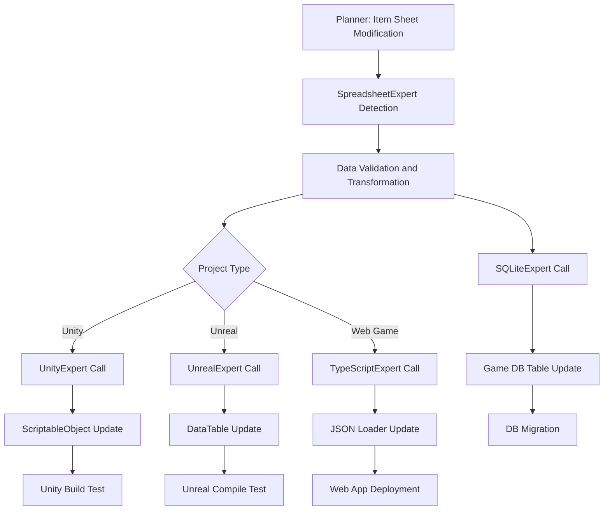

# Data Pipeline Workflows

## Overview
This document defines a complete automation workflow for planning-development data pipelines centered around SpreadsheetExpert.

## Core Architecture

### 🏗️ Data Flow Structure
```
Planner (Excel/Google Sheets) → SpreadsheetExpert → Language Experts → Game/App
                                    ↓
                                DB Experts → Database
```

### 🎯 Role-Based Responsibility Separation

#### SpreadsheetExpert (Data Source Hub)
- **Input**: Excel files, Google Spreadsheets
- **Output**: JSON, CSV, YAML and other structured data
- **Role**: Data validation, transformation, quality management

#### Language Experts (Implementation Handlers)
- **Input**: Transformed data from SpreadsheetExpert
- **Output**: Runtime code, data loaders, structs/classes
- **Role**: Platform-specific data utilization code generation

#### DB Experts (Storage Managers)
- **Input**: Structured data from SpreadsheetExpert
- **Output**: DDL, migrations, optimized queries
- **Role**: Data persistence and performance optimization

## Real Workflow Scenarios

### 🎮 Scenario 1: Game Item Data Update

#### Situation
Planner adds new weapon items and adjusts balance of existing items

#### Workflow


#### Specific Steps

**Step 1: Change Detection and Validation (SpreadsheetExpert)**
```python
# Automatically executed process
def on_spreadsheet_change(file_path: str):
    # 1. Load changed sheet
    processor = ExcelProcessor(file_path)
    sheets = processor.load_excel()
    
    # 2. Data validation
    validation_rules = GAME_ITEM_RULES
    errors = processor.validate_data("Items", validation_rules)
    
    if errors:
        # Send error report to planner
        send_error_report(errors)
        return
    
    # 3. Data transformation
    game_processor = GameDataProcessor(processor)
    item_data = game_processor.process_item_data()
    
    # 4. Trigger next steps
    trigger_language_experts(item_data)
    trigger_db_experts(item_data)
```

**Step 2: Platform-Specific Code Generation (Language Experts)**

**Unity (UnityExpert)**
```csharp
// Auto-generated C# code
[System.Serializable]
public class ItemDatabase : MonoBehaviour
{
    [SerializeField] private List<ItemData> items;
    
    public void LoadFromJson(string jsonPath)
    {
        string jsonContent = File.ReadAllText(jsonPath);
        var itemContainer = JsonUtility.FromJson<ItemContainer>(jsonContent);
        items = itemContainer.items;
        Debug.Log($"Loaded {items.Count} items");
    }
    
    public ItemData GetItem(string itemId)
    {
        return items.Find(item => item.id == itemId);
    }
}
```

**TypeScript (TypeScriptExpert)**
```typescript
// Auto-generated TypeScript code
interface ItemData {
  id: string;
  name: string;
  type: ItemType;
  stats: ItemStats;
  price: PriceData;
}

class ItemManager {
  private items: Map<string, ItemData> = new Map();
  
  async loadItems(dataUrl: string): Promise<void> {
    try {
      const response = await fetch(dataUrl);
      const data = await response.json();
      
      for (const [id, item] of Object.entries(data.items)) {
        this.items.set(id, item as ItemData);
      }
      
      console.log(`Loaded ${this.items.size} items`);
    } catch (error) {
      console.error('Failed to load items:', error);
    }
  }
  
  getItem(itemId: string): ItemData | undefined {
    return this.items.get(itemId);
  }
}
```

**Step 3: Database Schema Update (DB Experts)**

**SQLite (SQLiteExpert)**
```sql
-- Auto-generated migration
BEGIN TRANSACTION;

-- Add new columns (fields added by planner)
ALTER TABLE items ADD COLUMN durability INTEGER DEFAULT 100;
ALTER TABLE items ADD COLUMN enchant_level INTEGER DEFAULT 0;

-- Update existing data (balance adjustments)
UPDATE items SET attack_power = attack_power * 1.1 WHERE item_type = 'weapon';
UPDATE items SET price = ROUND(price * 0.95) WHERE rarity = 'common';

-- Add new items
INSERT INTO items (id, name, type, rarity, attack_power, price, durability) VALUES
('sword_legendary_001', 'Excalibur', 'weapon', 'legendary', 250, 10000, 200),
('shield_epic_001', 'Dragon Shield', 'armor', 'epic', 0, 5000, 150);

COMMIT;
```

### 🌐 Scenario 2: Multi-Language Support System

#### Situation
Adding new language (Japanese) and modifying existing text

#### Workflow

**Step 1: Localization Sheet Processing**
```python
def process_localization_update():
    # Get latest translation data from Google Sheets
    sheets_processor = GoogleSheetsProcessor('credentials.json')
    df = sheets_processor.load_sheet(LOCALIZATION_SHEET_ID, 'Translations')
    
    # Structure multi-language data
    localization_data = process_localization_data(df)
    
    # Generate files for each language
    for language, texts in localization_data['localization'].items():
        output_path = f"Assets/Localization/{language}.json"
        with open(output_path, 'w', encoding='utf-8') as f:
            json.dump(texts, f, ensure_ascii=False, indent=2)
    
    # Notify language experts
    notify_language_experts(localization_data)
```

**Step 2: Platform-Specific Localization System Update**

**Unity (UnityExpert)**
```csharp
public class LocalizationManager : MonoBehaviour
{
    [SerializeField] private SystemLanguage currentLanguage;
    private Dictionary<string, string> localizedTexts = new Dictionary<string, string>();
    
    void Start()
    {
        LoadLocalization(Application.systemLanguage);
    }
    
    public void LoadLocalization(SystemLanguage language)
    {
        string languageCode = GetLanguageCode(language);
        string path = Path.Combine(Application.streamingAssetsPath, $"Localization/{languageCode}.json");
        
        if (File.Exists(path))
        {
            string jsonContent = File.ReadAllText(path, Encoding.UTF8);
            var localizationData = JsonUtility.FromJson<LocalizationData>(jsonContent);
            
            localizedTexts.Clear();
            foreach (var item in localizationData.texts)
            {
                localizedTexts[item.key] = item.value;
            }
            
            currentLanguage = language;
            UpdateAllLocalizedTexts();
        }
    }
    
    public string GetLocalizedText(string key)
    {
        return localizedTexts.TryGetValue(key, out string value) ? value : $"[MISSING: {key}]";
    }
}
```

### 📊 Scenario 3: Real-Time Balancing System

#### Situation
Emergency balance patch needed while game is live

#### Workflow

**Step 1: Hotfix Data Preparation**
```python
class HotfixPipeline:
    def __init__(self):
        self.validator = DataQualityManager()
        self.sync_server = DataSyncServer()
    
    def process_hotfix(self, sheet_id: str, worksheet: str):
        # 1. Detect changed data
        processor = GoogleSheetsProcessor('hotfix_credentials.json')
        df = processor.load_sheet(sheet_id, worksheet)
        
        # 2. Strict validation (live environment)
        errors = self.validator.check_data_quality(df, 'hotfix_data')
        if errors['quality_score'] < 95:
            raise ValueError("Hotfix data quality is below standards.")
        
        # 3. Safe transformation
        game_processor = GameDataProcessor(processor)
        hotfix_data = game_processor.process_skill_data()
        
        # 4. Staging environment test
        if not self.test_in_staging(hotfix_data):
            raise ValueError("Staging test failed")
        
        # 5. Live deployment
        self.deploy_to_live(hotfix_data)
        
        # 6. Real-time client notification
        asyncio.create_task(
            self.sync_server.broadcast_update({
                'type': 'hotfix',
                'data': hotfix_data,
                'timestamp': datetime.now().isoformat()
            })
        )
```

**Step 2: Client Real-Time Update**

**Node.js (NodeJSExpert)**
```javascript
// Server-side hotfix deployment
class HotfixDeployment {
    constructor() {
        this.redisClient = redis.createClient();
        this.wsServer = new WebSocketServer({ port: 8080 });
    }
    
    async deployHotfix(hotfixData) {
        try {
            // Store hotfix data in Redis
            await this.redisClient.setex(
                'game_data:hotfix', 
                3600, 
                JSON.stringify(hotfixData)
            );
            
            // Notify all connected clients
            const message = {
                type: 'data_update',
                category: 'hotfix',
                data: hotfixData,
                timestamp: new Date().toISOString()
            };
            
            this.wsServer.clients.forEach(client => {
                if (client.readyState === WebSocket.OPEN) {
                    client.send(JSON.stringify(message));
                }
            });
            
            console.log('Hotfix deployment completed:', hotfixData.version);
            
        } catch (error) {
            console.error('Hotfix deployment failed:', error);
            throw error;
        }
    }
}
```

## Advanced Automation Features

### 🔄 Intelligent Conflict Resolution

#### Concurrent Edit Conflict Handling
```python
class ConflictResolver:
    def __init__(self):
        self.version_control = VersionControl()
    
    def resolve_concurrent_edits(self, changes_a: Dict, changes_b: Dict) -> Dict:
        """Resolve concurrent edit conflicts between two users"""
        
        # 1. Analyze changes
        conflicts = self.find_conflicts(changes_a, changes_b)
        
        # 2. Handle automatically resolvable conflicts
        auto_resolved = []
        manual_required = []
        
        for conflict in conflicts:
            if conflict['type'] == 'non_overlapping':
                # Different field modifications -> auto merge
                auto_resolved.append(conflict)
            elif conflict['type'] == 'additive':
                # Both adding new rows -> auto merge
                auto_resolved.append(conflict)
            else:
                # Same field different values -> manual resolution required
                manual_required.append(conflict)
        
        # 3. Generate merged result
        merged_result = self.merge_changes(changes_a, changes_b, auto_resolved)
        
        if manual_required:
            # Request manual resolution from planner
            self.request_manual_resolution(manual_required)
            return None
        
        return merged_result
```

### 📈 Performance Monitoring and Optimization

#### Data Pipeline Performance Tracking
```python
class PipelineMonitor:
    def __init__(self):
        self.metrics = defaultdict(list)
        self.alerts = AlertManager()
    
    def track_performance(self, stage: str, duration: float, data_size: int):
        """Measure performance by stage"""
        metric = {
            'timestamp': datetime.now(),
            'stage': stage,
            'duration': duration,
            'data_size': data_size,
            'throughput': data_size / duration
        }
        
        self.metrics[stage].append(metric)
        
        # Check performance thresholds
        if duration > self.get_threshold(stage):
            self.alerts.send_performance_warning(stage, duration)
    
    def get_optimization_suggestions(self) -> List[str]:
        """Performance optimization suggestions"""
        suggestions = []
        
        for stage, metrics in self.metrics.items():
            recent_metrics = metrics[-10:]  # Last 10
            avg_duration = sum(m['duration'] for m in recent_metrics) / len(recent_metrics)
            
            if stage == 'excel_processing' and avg_duration > 5.0:
                suggestions.append("Recommend enabling chunk processing mode for large Excel files")
            
            elif stage == 'data_validation' and avg_duration > 2.0:
                suggestions.append("Recommend optimizing data validation rules or introducing parallel processing")
            
            elif stage == 'code_generation' and avg_duration > 10.0:
                suggestions.append("Recommend introducing code template caching or incremental generation")
        
        return suggestions
```

### 🎯 Smart Recommendation System

#### Data Structure Optimization Suggestions
```python
class SmartRecommendation:
    def __init__(self):
        self.analyzer = DataStructureAnalyzer()
    
    def analyze_spreadsheet_structure(self, df: pd.DataFrame) -> Dict[str, Any]:
        """Analyze spreadsheet structure and suggest improvements"""
        
        analysis = {
            'data_types': self.analyzer.analyze_data_types(df),
            'relationships': self.analyzer.find_relationships(df),
            'normalization': self.analyzer.check_normalization(df),
            'performance': self.analyzer.estimate_performance(df)
        }
        
        recommendations = []
        
        # 1. Data type optimization
        for col, dtype_info in analysis['data_types'].items():
            if dtype_info['recommended'] != dtype_info['current']:
                recommendations.append({
                    'type': 'data_type_optimization',
                    'column': col,
                    'current': dtype_info['current'],
                    'recommended': dtype_info['recommended'],
                    'benefit': dtype_info['memory_saving']
                })
        
        # 2. Normalization suggestions
        if analysis['normalization']['score'] < 0.7:
            recommendations.append({
                'type': 'normalization',
                'current_score': analysis['normalization']['score'],
                'suggestions': analysis['normalization']['suggestions']
            })
        
        # 3. Indexing suggestions
        for col in analysis['performance']['index_candidates']:
            recommendations.append({
                'type': 'indexing',
                'column': col,
                'reason': 'Frequently searched column',
                'expected_improvement': '50-80% search performance improvement'
            })
        
        return {
            'analysis': analysis,
            'recommendations': recommendations,
            'priority_score': self.calculate_priority_score(recommendations)
        }
```

## Quality Assurance and Testing

### 🧪 Automated Testing System

#### Data Quality Testing
```python
class DataQualityTests:
    def __init__(self):
        self.test_suite = TestSuite()
    
    def run_quality_tests(self, data: Dict) -> TestResult:
        """Execute comprehensive data quality tests"""
        
        results = TestResult()
        
        # 1. Schema validity test
        schema_result = self.test_schema_compliance(data)
        results.add('schema_compliance', schema_result)
        
        # 2. Business rules test
        business_result = self.test_business_rules(data)
        results.add('business_rules', business_result)
        
        # 3. Referential integrity test
        integrity_result = self.test_referential_integrity(data)
        results.add('referential_integrity', integrity_result)
        
        # 4. Performance impact test
        performance_result = self.test_performance_impact(data)
        results.add('performance_impact', performance_result)
        
        # 5. Security vulnerability test
        security_result = self.test_security_vulnerabilities(data)
        results.add('security', security_result)
        
        return results
    
    def test_business_rules(self, data: Dict) -> TestResult:
        """Validate game business rules"""
        errors = []
        
        # Item price reasonableness check
        for item_id, item in data.get('items', {}).items():
            if item['type'] == 'weapon' and item['price']['buy'] < item['stats']['attack'] * 10:
                errors.append(f"Weapon {item_id} price is too low compared to attack power.")
            
            if item['rarity'] == 'legendary' and item['price']['buy'] < 1000:
                errors.append(f"Legendary item {item_id} price is too low.")
        
        return TestResult(success=len(errors) == 0, errors=errors)
```

## Collaboration Optimization Guidelines

### ✅ Best Practices

1. **Data Structure Design**
   - Use clear column naming conventions
   - Maintain data type consistency
   - Distinguish required vs optional fields

2. **Real-time Collaboration**
   - Commit changes immediately
   - Rapid resolution when conflicts occur
   - Utilize version control systems

3. **Quality Management**
   - Regular data validation
   - Execute automated tests
   - Continuous performance monitoring

### ❌ Anti-Patterns to Avoid

1. **Data Management**
   - Prohibit manual copy-paste operations
   - Prohibit duplicate data source operations
   - Prohibit production deployment without validation

2. **Collaboration Methods**
   - Prohibit direct DB modifications
   - Prohibit direct communication between language experts
   - Prohibit unilateral technical decisions

---

**Through this workflow, a completely automated data pipeline can be built where planner spreadsheet changes are automatically reflected in games and systems.**