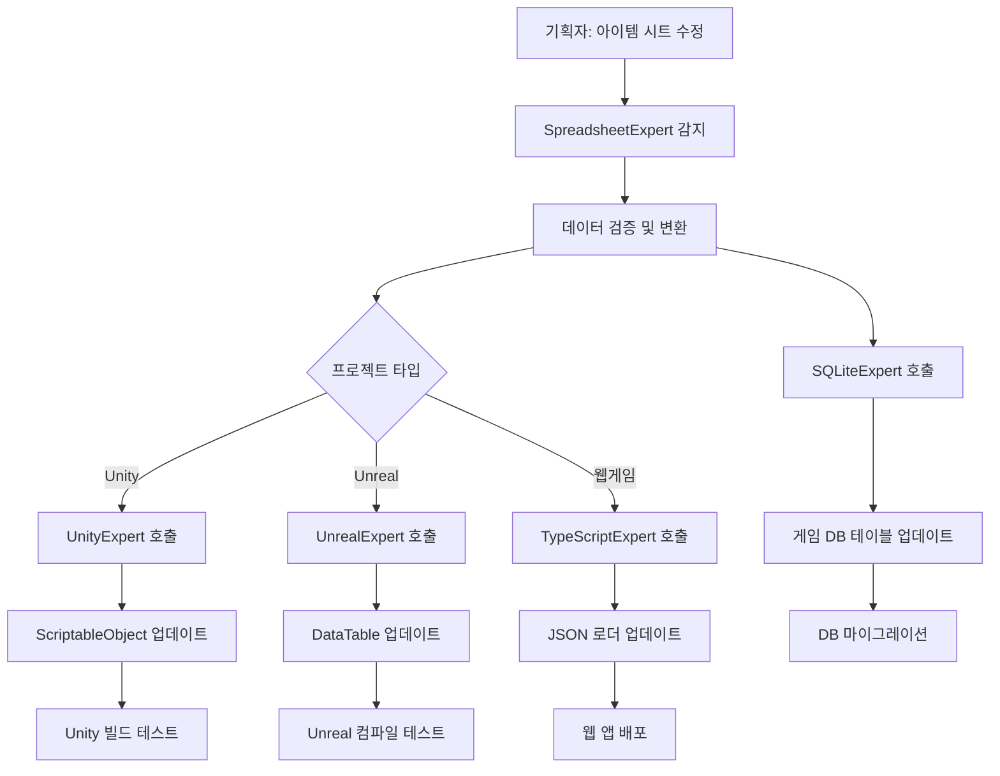

# 데이터 파이프라인 워크플로우

## 개요
SpreadsheetExpert를 중심으로 한 기획-개발 간 데이터 파이프라인의 완전 자동화 워크플로우를 정의합니다.

## 핵심 아키텍처

### 🏗️ 데이터 플로우 구조
```
기획자 (엑셀/구글시트) → SpreadsheetExpert → 언어 전문가 → 게임/앱
                                    ↓
                                DB 전문가 → 데이터베이스
```

### 🎯 역할별 책임 분리

#### SpreadsheetExpert (데이터 소스 허브)
- **입력**: 엑셀 파일, 구글 스프레드시트
- **출력**: JSON, CSV, YAML 등 구조화된 데이터
- **역할**: 데이터 검증, 변환, 품질 관리

#### 언어 전문가 (구현 담당)
- **입력**: SpreadsheetExpert의 변환된 데이터
- **출력**: 런타임 코드, 데이터 로더, 구조체/클래스
- **역할**: 플랫폼별 데이터 활용 코드 생성

#### DB 전문가 (저장소 관리)
- **입력**: SpreadsheetExpert의 구조화된 데이터
- **출력**: DDL, 마이그레이션, 최적화된 쿼리
- **역할**: 데이터 영속성 및 성능 최적화

## 실제 워크플로우 시나리오

### 🎮 시나리오 1: 게임 아이템 데이터 업데이트

#### 상황
기획자가 새로운 무기 아이템을 추가하고 기존 아이템의 밸런스를 수정

#### 워크플로우


#### 구체적 단계

**1단계: 변경 감지 및 검증 (SpreadsheetExpert)**
```python
# 자동 실행되는 프로세스
def on_spreadsheet_change(file_path: str):
    # 1. 변경된 시트 로드
    processor = ExcelProcessor(file_path)
    sheets = processor.load_excel()
    
    # 2. 데이터 검증
    validation_rules = GAME_ITEM_RULES
    errors = processor.validate_data("Items", validation_rules)
    
    if errors:
        # 기획자에게 에러 리포트 전송
        send_error_report(errors)
        return
    
    # 3. 데이터 변환
    game_processor = GameDataProcessor(processor)
    item_data = game_processor.process_item_data()
    
    # 4. 다음 단계 트리거
    trigger_language_experts(item_data)
    trigger_db_experts(item_data)
```

**2단계: 플랫폼별 코드 생성 (언어 전문가)**

**Unity (UnityExpert)**
```csharp
// 자동 생성되는 C# 코드
[System.Serializable]
public class ItemDatabase : MonoBehaviour
{
    [SerializeField] private List<ItemData> items;
    
    public void LoadFromJson(string jsonPath)
    {
        string jsonContent = File.ReadAllText(jsonPath);
        var itemContainer = JsonUtility.FromJson<ItemContainer>(jsonContent);
        items = itemContainer.items;
        Debug.Log($"아이템 {items.Count}개 로드 완료");
    }
    
    public ItemData GetItem(string itemId)
    {
        return items.Find(item => item.id == itemId);
    }
}
```

**TypeScript (TypeScriptExpert)**
```typescript
// 자동 생성되는 TypeScript 코드
interface ItemData {
  id: string;
  name: string;
  type: ItemType;
  stats: ItemStats;
  price: PriceData;
}

class ItemManager {
  private items: Map<string, ItemData> = new Map();
  
  async loadItems(dataUrl: string): Promise<void> {
    try {
      const response = await fetch(dataUrl);
      const data = await response.json();
      
      for (const [id, item] of Object.entries(data.items)) {
        this.items.set(id, item as ItemData);
      }
      
      console.log(`아이템 ${this.items.size}개 로드 완료`);
    } catch (error) {
      console.error('아이템 로드 실패:', error);
    }
  }
  
  getItem(itemId: string): ItemData | undefined {
    return this.items.get(itemId);
  }
}
```

**3단계: 데이터베이스 스키마 업데이트 (DB 전문가)**

**SQLite (SQLiteExpert)**
```sql
-- 자동 생성되는 마이그레이션
BEGIN TRANSACTION;

-- 새로운 컬럼 추가 (기획자가 추가한 필드)
ALTER TABLE items ADD COLUMN durability INTEGER DEFAULT 100;
ALTER TABLE items ADD COLUMN enchant_level INTEGER DEFAULT 0;

-- 기존 데이터 업데이트 (밸런스 조정)
UPDATE items SET attack_power = attack_power * 1.1 WHERE item_type = 'weapon';
UPDATE items SET price = ROUND(price * 0.95) WHERE rarity = 'common';

-- 새 아이템 추가
INSERT INTO items (id, name, type, rarity, attack_power, price, durability) VALUES
('sword_legendary_001', 'Excalibur', 'weapon', 'legendary', 250, 10000, 200),
('shield_epic_001', 'Dragon Shield', 'armor', 'epic', 0, 5000, 150);

COMMIT;
```

### 🌐 시나리오 2: 다국어 지원 시스템

#### 상황
새로운 언어(일본어) 추가 및 기존 텍스트 수정

#### 워크플로우

**1단계: 로컬라이제이션 시트 처리**
```python
def process_localization_update():
    # 구글 시트에서 최신 번역 데이터 가져오기
    sheets_processor = GoogleSheetsProcessor('credentials.json')
    df = sheets_processor.load_sheet(LOCALIZATION_SHEET_ID, 'Translations')
    
    # 다국어 데이터 구조화
    localization_data = process_localization_data(df)
    
    # 각 언어별 파일 생성
    for language, texts in localization_data['localization'].items():
        output_path = f"Assets/Localization/{language}.json"
        with open(output_path, 'w', encoding='utf-8') as f:
            json.dump(texts, f, ensure_ascii=False, indent=2)
    
    # 언어 전문가들에게 알림
    notify_language_experts(localization_data)
```

**2단계: 플랫폼별 로컬라이제이션 시스템 업데이트**

**Unity (UnityExpert)**
```csharp
public class LocalizationManager : MonoBehaviour
{
    [SerializeField] private SystemLanguage currentLanguage;
    private Dictionary<string, string> localizedTexts = new Dictionary<string, string>();
    
    void Start()
    {
        LoadLocalization(Application.systemLanguage);
    }
    
    public void LoadLocalization(SystemLanguage language)
    {
        string languageCode = GetLanguageCode(language);
        string path = Path.Combine(Application.streamingAssetsPath, $"Localization/{languageCode}.json");
        
        if (File.Exists(path))
        {
            string jsonContent = File.ReadAllText(path, Encoding.UTF8);
            var localizationData = JsonUtility.FromJson<LocalizationData>(jsonContent);
            
            localizedTexts.Clear();
            foreach (var item in localizationData.texts)
            {
                localizedTexts[item.key] = item.value;
            }
            
            currentLanguage = language;
            UpdateAllLocalizedTexts();
        }
    }
    
    public string GetLocalizedText(string key)
    {
        return localizedTexts.TryGetValue(key, out string value) ? value : $"[MISSING: {key}]";
    }
}
```

### 📊 시나리오 3: 실시간 밸런싱 시스템

#### 상황
게임이 라이브 중인 상태에서 긴급 밸런스 패치 필요

#### 워크플로우

**1단계: 핫픽스 데이터 준비**
```python
class HotfixPipeline:
    def __init__(self):
        self.validator = DataQualityManager()
        self.sync_server = DataSyncServer()
    
    def process_hotfix(self, sheet_id: str, worksheet: str):
        # 1. 변경된 데이터 감지
        processor = GoogleSheetsProcessor('hotfix_credentials.json')
        df = processor.load_sheet(sheet_id, worksheet)
        
        # 2. 엄격한 검증 (라이브 환경)
        errors = self.validator.check_data_quality(df, 'hotfix_data')
        if errors['quality_score'] < 95:
            raise ValueError("핫픽스 데이터 품질이 기준에 미달합니다.")
        
        # 3. 안전한 변환
        game_processor = GameDataProcessor(processor)
        hotfix_data = game_processor.process_skill_data()
        
        # 4. 스테이징 환경 테스트
        if not self.test_in_staging(hotfix_data):
            raise ValueError("스테이징 테스트 실패")
        
        # 5. 라이브 배포
        self.deploy_to_live(hotfix_data)
        
        # 6. 실시간 클라이언트 알림
        asyncio.create_task(
            self.sync_server.broadcast_update({
                'type': 'hotfix',
                'data': hotfix_data,
                'timestamp': datetime.now().isoformat()
            })
        )
```

**2단계: 클라이언트 실시간 업데이트**

**Node.js (NodeJSExpert)**
```javascript
// 서버 사이드 핫픽스 배포
class HotfixDeployment {
    constructor() {
        this.redisClient = redis.createClient();
        this.wsServer = new WebSocketServer({ port: 8080 });
    }
    
    async deployHotfix(hotfixData) {
        try {
            // Redis에 핫픽스 데이터 저장
            await this.redisClient.setex(
                'game_data:hotfix', 
                3600, 
                JSON.stringify(hotfixData)
            );
            
            // 모든 연결된 클라이언트에게 알림
            const message = {
                type: 'data_update',
                category: 'hotfix',
                data: hotfixData,
                timestamp: new Date().toISOString()
            };
            
            this.wsServer.clients.forEach(client => {
                if (client.readyState === WebSocket.OPEN) {
                    client.send(JSON.stringify(message));
                }
            });
            
            console.log('핫픽스 배포 완료:', hotfixData.version);
            
        } catch (error) {
            console.error('핫픽스 배포 실패:', error);
            throw error;
        }
    }
}
```

## 고급 자동화 기능

### 🔄 지능형 충돌 해결

#### 동시 편집 충돌 처리
```python
class ConflictResolver:
    def __init__(self):
        self.version_control = VersionControl()
    
    def resolve_concurrent_edits(self, changes_a: Dict, changes_b: Dict) -> Dict:
        """두 사용자의 동시 편집 충돌 해결"""
        
        # 1. 변경 사항 분석
        conflicts = self.find_conflicts(changes_a, changes_b)
        
        # 2. 자동 해결 가능한 충돌 처리
        auto_resolved = []
        manual_required = []
        
        for conflict in conflicts:
            if conflict['type'] == 'non_overlapping':
                # 서로 다른 필드 수정 -> 자동 병합
                auto_resolved.append(conflict)
            elif conflict['type'] == 'additive':
                # 둘 다 새 행 추가 -> 자동 병합
                auto_resolved.append(conflict)
            else:
                # 같은 필드 다른 값 -> 수동 해결 필요
                manual_required.append(conflict)
        
        # 3. 병합된 결과 생성
        merged_result = self.merge_changes(changes_a, changes_b, auto_resolved)
        
        if manual_required:
            # 기획자에게 수동 해결 요청
            self.request_manual_resolution(manual_required)
            return None
        
        return merged_result
```

### 📈 성능 모니터링 및 최적화

#### 데이터 파이프라인 성능 추적
```python
class PipelineMonitor:
    def __init__(self):
        self.metrics = defaultdict(list)
        self.alerts = AlertManager()
    
    def track_performance(self, stage: str, duration: float, data_size: int):
        """각 단계별 성능 측정"""
        metric = {
            'timestamp': datetime.now(),
            'stage': stage,
            'duration': duration,
            'data_size': data_size,
            'throughput': data_size / duration
        }
        
        self.metrics[stage].append(metric)
        
        # 성능 임계값 확인
        if duration > self.get_threshold(stage):
            self.alerts.send_performance_warning(stage, duration)
    
    def get_optimization_suggestions(self) -> List[str]:
        """성능 최적화 제안"""
        suggestions = []
        
        for stage, metrics in self.metrics.items():
            recent_metrics = metrics[-10:]  # 최근 10개
            avg_duration = sum(m['duration'] for m in recent_metrics) / len(recent_metrics)
            
            if stage == 'excel_processing' and avg_duration > 5.0:
                suggestions.append("대용량 엑셀 파일에 대해 청크 처리 모드 활성화 권장")
            
            elif stage == 'data_validation' and avg_duration > 2.0:
                suggestions.append("데이터 검증 규칙 최적화 또는 병렬 처리 도입 권장")
            
            elif stage == 'code_generation' and avg_duration > 10.0:
                suggestions.append("코드 템플릿 캐싱 또는 증분 생성 방식 도입 권장")
        
        return suggestions
```

### 🎯 스마트 추천 시스템

#### 데이터 구조 최적화 제안
```python
class SmartRecommendation:
    def __init__(self):
        self.analyzer = DataStructureAnalyzer()
    
    def analyze_spreadsheet_structure(self, df: pd.DataFrame) -> Dict[str, Any]:
        """스프레드시트 구조 분석 및 개선 제안"""
        
        analysis = {
            'data_types': self.analyzer.analyze_data_types(df),
            'relationships': self.analyzer.find_relationships(df),
            'normalization': self.analyzer.check_normalization(df),
            'performance': self.analyzer.estimate_performance(df)
        }
        
        recommendations = []
        
        # 1. 데이터 타입 최적화
        for col, dtype_info in analysis['data_types'].items():
            if dtype_info['recommended'] != dtype_info['current']:
                recommendations.append({
                    'type': 'data_type_optimization',
                    'column': col,
                    'current': dtype_info['current'],
                    'recommended': dtype_info['recommended'],
                    'benefit': dtype_info['memory_saving']
                })
        
        # 2. 정규화 제안
        if analysis['normalization']['score'] < 0.7:
            recommendations.append({
                'type': 'normalization',
                'current_score': analysis['normalization']['score'],
                'suggestions': analysis['normalization']['suggestions']
            })
        
        # 3. 인덱싱 제안
        for col in analysis['performance']['index_candidates']:
            recommendations.append({
                'type': 'indexing',
                'column': col,
                'reason': '자주 검색되는 컬럼',
                'expected_improvement': '50-80% 검색 성능 향상'
            })
        
        return {
            'analysis': analysis,
            'recommendations': recommendations,
            'priority_score': self.calculate_priority_score(recommendations)
        }
```

## 품질 보증 및 테스팅

### 🧪 자동 테스트 시스템

#### 데이터 품질 테스트
```python
class DataQualityTests:
    def __init__(self):
        self.test_suite = TestSuite()
    
    def run_quality_tests(self, data: Dict) -> TestResult:
        """포괄적인 데이터 품질 테스트 실행"""
        
        results = TestResult()
        
        # 1. 스키마 유효성 테스트
        schema_result = self.test_schema_compliance(data)
        results.add('schema_compliance', schema_result)
        
        # 2. 비즈니스 룰 테스트
        business_result = self.test_business_rules(data)
        results.add('business_rules', business_result)
        
        # 3. 참조 무결성 테스트
        integrity_result = self.test_referential_integrity(data)
        results.add('referential_integrity', integrity_result)
        
        # 4. 성능 임팩트 테스트
        performance_result = self.test_performance_impact(data)
        results.add('performance_impact', performance_result)
        
        # 5. 보안 취약점 테스트
        security_result = self.test_security_vulnerabilities(data)
        results.add('security', security_result)
        
        return results
    
    def test_business_rules(self, data: Dict) -> TestResult:
        """게임 비즈니스 룰 검증"""
        errors = []
        
        # 아이템 가격 합리성 검사
        for item_id, item in data.get('items', {}).items():
            if item['type'] == 'weapon' and item['price']['buy'] < item['stats']['attack'] * 10:
                errors.append(f"무기 {item_id}의 가격이 공격력 대비 너무 낮습니다.")
            
            if item['rarity'] == 'legendary' and item['price']['buy'] < 1000:
                errors.append(f"전설 아이템 {item_id}의 가격이 너무 낮습니다.")
        
        return TestResult(success=len(errors) == 0, errors=errors)
```

## 협업 최적화 가이드라인

### ✅ 모범 사례 (Best Practices)

1. **데이터 구조 설계**
   - 명확한 컬럼 명명 규칙 사용
   - 데이터 타입 일관성 유지
   - 필수 필드와 선택 필드 구분

2. **실시간 협업**
   - 변경 사항 즉시 커밋
   - 충돌 발생시 신속한 해결
   - 버전 관리 시스템 활용

3. **품질 관리**
   - 정기적인 데이터 검증
   - 자동화된 테스트 실행
   - 성능 모니터링 지속

### ❌ 피해야 할 것들 (Anti-Patterns)

1. **데이터 관리**
   - 수동 복사-붙여넣기 금지
   - 중복 데이터 소스 운영 금지
   - 검증 없는 프로덕션 배포 금지

2. **협업 방식**
   - 직접적인 DB 수정 금지
   - 언어 전문가 간 직접 소통 금지
   - 일방적인 기술 결정 금지

---

**이 워크플로우를 통해 기획자의 스프레드시트 변경이 자동으로 게임과 시스템 전체에 반영되는 완전 자동화된 데이터 파이프라인을 구축할 수 있습니다.**