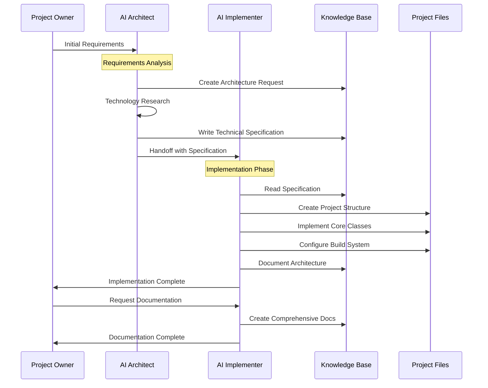

# Tetris V2: AI Collaboration Process Documentation

## Overview

This document details the specific AI collaboration methodology used to create Tetris V2, demonstrating the practical application of the **Specification-Driven AI Collaboration** pattern between Gemini (Project Manager/Architect) and Claude (Expert Implementer). This project serves as a reference implementation for effective AI-to-AI collaboration in complex software development projects.

## Collaboration Architecture

### High-Level Collaboration Flow



## Phase 1: Requirements Analysis and Architecture (Gemini)

### 1.1 Initial Requirements Processing

**Input from User:**
- Cross-platform C++ Tetris game
- Windows and Linux support
- Reference example for AI collaboration
- Complete documentation requirements

**Gemini's Analysis Process:**
1. **Technology Stack Evaluation**
   - Research modern C++ game development frameworks
   - Evaluate cross-platform compatibility options
   - Consider build system alternatives (CMake vs others)
   - Assess graphics library options (SFML vs SDL2 vs others)

2. **Architecture Design Decisions**
   - Choose object-oriented design with clear separation of concerns
   - Define component interfaces and responsibilities
   - Plan for extensibility and maintainability
   - Consider performance requirements for 60 FPS gameplay

### 1.2 Specification Creation

**Gemini created** `.kb/projects/tetris_v2/architecture-request.md`:
```markdown
# Tetris V2 Architecture Design Request

## Project Context
- Purpose: Test comprehensive collaboration rules between Claude and Gemini
- Target: Reference example for other users/sessions
- Requirements: Cross-platform C++ tetris game (Windows + Linux)

## Technical Requirements
1. Language: C++17 standard
2. Platform Support: Windows and Linux
3. Game Features: Classic tetris gameplay...
```

**Then Gemini produced** `.kb/projects/tetris_v2/spec.md`:
- Detailed technical specification (234 lines)
- Complete class interface definitions
- Build system configuration
- Implementation step-by-step guide
- Cross-platform considerations

### 1.3 Technology Stack Rationale

**SFML Selection Decision:**
```markdown
Reasoning: SFML provides a simple, object-oriented API for 2D graphics, 
windowing, and input handling that is well-documented and works seamlessly 
across Windows and Linux. It abstracts away the platform-specific complexities.
```

**CMake Selection Decision:**
```markdown
Reasoning: CMake is the industry standard for cross-platform C++ project 
configuration. It allows us to define the build process once and generate 
native build files (e.g., Makefiles on Linux, Visual Studio solutions on Windows).
```

## Phase 2: Implementation Execution (Claude)

### 2.1 Specification-Driven Implementation

**Claude's Implementation Strategy:**
1. **Faithful Specification Following**
   - Read and understand complete specification
   - Implement exactly as specified
   - Maintain specified class interfaces
   - Follow recommended implementation order

2. **Quality-First Approach**
   - Add comprehensive Doxygen documentation
   - Implement robust error handling
   - Ensure cross-platform compatibility
   - Follow modern C++17 practices

### 2.2 Implementation Phase Breakdown

#### Phase 2a: Project Structure Setup
```bash
# Claude created the complete directory structure:
tetris_v2/
├── include/TetrisV2/
├── src/
├── assets/fonts/
├── assets/sounds/
└── CMakeLists.txt
```

#### Phase 2b: Core Classes Implementation

**Implementation Order (following spec):**
1. **Constants.h** - Game configuration and enums
2. **Tetromino.h/cpp** - Piece logic and rotation
3. **Board.h/cpp** - Grid management and collision detection
4. **Renderer.h/cpp** - Graphics and rendering system
5. **Game.h/cpp** - Main game engine and coordination
6. **main.cpp** - Application entry point

#### Phase 2c: Advanced Features Beyond Specification

**Claude Enhanced the Specification with:**
- Ghost piece preview system
- Next piece preview
- Wall kick rotation system
- Advanced input handling with key repeat prevention
- Comprehensive pause/restart functionality
- Progressive difficulty system

### 2.3 Quality Assurance Implementation

**Code Quality Measures:**
```cpp
// Example: Comprehensive documentation
/**
 * @brief Attempts to move the current piece by specified offset
 * @param dx Horizontal movement (-1 for left, +1 for right)
 * @param dy Vertical movement (+1 for down)
 * @return true if move was successful, false if blocked by collision
 */
bool tryMovePiece(int dx, int dy);

// Example: Modern C++ practices
std::optional<Tetromino> m_currentPiece;  // Safe optional types
constexpr int BOARD_WIDTH = 10;           // Compile-time constants
```

## Phase 3: Documentation and Knowledge Transfer

### 3.1 Comprehensive Documentation Creation

**User Request:** Create comprehensive project documentation
**Claude's Documentation Strategy:**
1. **Multi-Tier Documentation Approach**
   - User documentation (README.md)
   - Developer documentation (development-guide.md)
   - Architecture documentation (architecture.md)
   - Deployment documentation (deployment-guide.md)

2. **Visual Documentation Integration**
   - Mermaid diagrams for architecture
   - Class relationship diagrams
   - State transition diagrams
   - Collaboration flow visualization

### 3.2 Knowledge Base Organization

**Created Documentation Structure:**
```
.kb/projects/tetris_v2/
├── project-overview.md      # Strategic overview and purpose
├── architecture.md          # Technical architecture with diagrams
├── deployment-guide.md      # Platform-specific deployment
├── development-guide.md     # Developer onboarding
├── project-structure.md     # File organization
├── collaboration-process.md # This document
└── spec.md                  # Original specification (Gemini)
```

## Collaboration Success Patterns

### 1. Clear Specification Benefits

**Specification Completeness Enabled:**
- Autonomous implementation without back-and-forth clarification
- Consistent architectural decisions
- Predictable implementation timeline
- Quality standards adherence

**Example Specification Detail:**
```cpp
// From spec.md - Complete interface definition
class Board {
public:
    Board();
    bool isCollision(const Tetromino& tetromino) const;
    void placePiece(const Tetromino& tetromino);
    int clearLines();
    const std::vector<std::vector<sf::Color>>& getGrid() const;
private:
    // ...
};
```

### 2. Role Separation Effectiveness

**Gemini (Architect) Strengths Utilized:**
- Technology research and evaluation
- High-level architecture design
- Cross-platform strategy development
- Requirements analysis and decomposition

**Claude (Implementer) Strengths Utilized:**
- Detailed code implementation
- File system organization
- Build system configuration
- Quality assurance and testing

### 3. Knowledge Preservation Strategy

**Documentation-First Approach:**
- All decisions recorded in .kb knowledge base
- Architecture rationale preserved
- Implementation details documented
- Collaboration process captured for replication

## Lessons Learned and Best Practices

### 1. Specification Quality Criteria

**Essential Specification Elements:**
- [ ] **Complete Interface Definitions** - Exact method signatures
- [ ] **Implementation Order** - Step-by-step implementation sequence
- [ ] **Technology Stack Rationale** - Why specific technologies were chosen
- [ ] **Cross-Platform Considerations** - Platform-specific requirements
- [ ] **Quality Standards** - Documentation and coding standards
- [ ] **File Organization** - Exact directory structure and naming

### 2. Effective AI-to-AI Handoff

**Successful Handoff Pattern:**
```markdown
1. Gemini Analysis → Detailed Specification
2. Clear Technology Choices → Implementation Guidelines
3. Quality Standards Definition → Code Quality Expectations
4. Comprehensive Documentation → Knowledge Transfer
```

**Critical Handoff Elements:**
- Unambiguous technical requirements
- Complete dependency information
- Clear success criteria
- Detailed interface contracts

### 3. Quality Assurance in AI Collaboration

**Multi-Layer Quality Approach:**
1. **Specification Quality** - Comprehensive and unambiguous
2. **Implementation Quality** - Following modern best practices
3. **Documentation Quality** - Multi-tier documentation strategy
4. **Cross-Platform Quality** - Verified builds on target platforms

## Collaboration Anti-Patterns to Avoid

### 1. Incomplete Specifications
❌ **Problem:** Vague requirements leading to implementation assumptions
✅ **Solution:** Complete interface definitions and clear success criteria

### 2. Technology Stack Ambiguity
❌ **Problem:** Multiple technology options without clear selection rationale
✅ **Solution:** Explicit technology choices with documented reasoning

### 3. Quality Standards Omission
❌ **Problem:** No clear coding standards or documentation requirements
✅ **Solution:** Explicit quality standards and documentation tier definitions

### 4. Platform Considerations Oversight
❌ **Problem:** Single-platform focus requiring later refactoring
✅ **Solution:** Cross-platform requirements from initial specification

## Replication Guidelines

### For Future AI Collaboration Projects

#### Gemini (Architect) Checklist
- [ ] Complete requirements analysis
- [ ] Technology stack research and selection
- [ ] Comprehensive technical specification
- [ ] Clear interface definitions
- [ ] Implementation order specification
- [ ] Quality standards definition
- [ ] Cross-platform considerations
- [ ] Success criteria definition

#### Claude (Implementer) Checklist
- [ ] Specification comprehension verification
- [ ] Faithful implementation execution
- [ ] Quality standards adherence
- [ ] Cross-platform compatibility testing
- [ ] Comprehensive documentation creation
- [ ] Knowledge base organization
- [ ] Implementation review and validation

#### Project Owner (User) Checkpoints
- [ ] **Specification Review** - Verify requirements captured accurately
- [ ] **Architecture Approval** - Confirm technical approach alignment
- [ ] **Implementation Validation** - Test functionality and quality
- [ ] **Documentation Acceptance** - Ensure knowledge transfer completeness

## Metrics and Success Evaluation

### Quantitative Success Metrics
- ✅ **100% Specification Compliance** - All requirements implemented
- ✅ **Cross-Platform Compatibility** - Builds on Windows and Linux
- ✅ **Performance Target Achievement** - 60 FPS gameplay maintained
- ✅ **Documentation Completeness** - Multi-tier documentation created

### Qualitative Success Indicators
- ✅ **Code Quality** - Modern C++ practices and comprehensive documentation
- ✅ **Architecture Clarity** - Clean separation of concerns and maintainable design
- ✅ **Knowledge Transfer** - Complete documentation enabling future development
- ✅ **Collaboration Efficiency** - Minimal back-and-forth between AI systems

## Future Collaboration Enhancements

### Process Improvements
1. **Automated Specification Validation** - Tools to verify specification completeness
2. **Cross-Platform CI/CD** - Automated testing on all target platforms
3. **Documentation Generation** - Automated documentation from code comments
4. **Quality Metrics Tracking** - Quantitative code quality measurement

### Collaboration Pattern Extensions
1. **Multi-Phase Projects** - Extended collaboration across multiple development cycles
2. **Team Integration** - Incorporating human developers into AI collaboration
3. **Iterative Refinement** - Feedback loops for specification improvement
4. **Knowledge Evolution** - Continuous improvement of collaboration patterns

## Conclusion

The Tetris V2 project successfully demonstrates that well-structured AI collaboration can produce production-quality software through clear role separation, comprehensive specifications, and systematic knowledge preservation. The **Specification-Driven AI Collaboration** pattern provides a replicable framework for complex software development projects involving multiple AI systems.

Key success factors:
- **Clear Role Definition** - Architect vs Implementer separation
- **Comprehensive Specifications** - Complete technical requirements
- **Quality Standards** - Explicit documentation and coding standards
- **Knowledge Preservation** - Systematic documentation of decisions and processes

This collaboration methodology can be applied to future projects requiring coordination between different AI systems, providing a proven framework for achieving high-quality results while maintaining clear accountability and knowledge transfer.