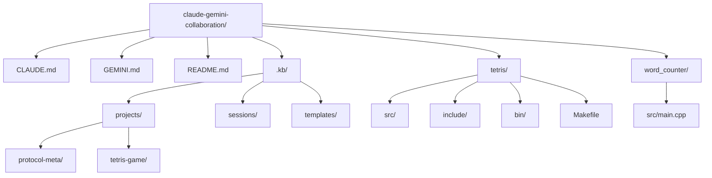
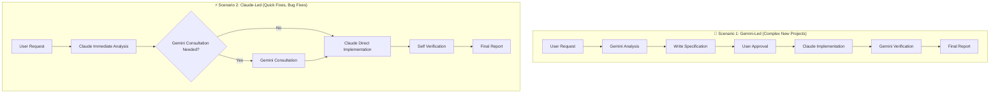
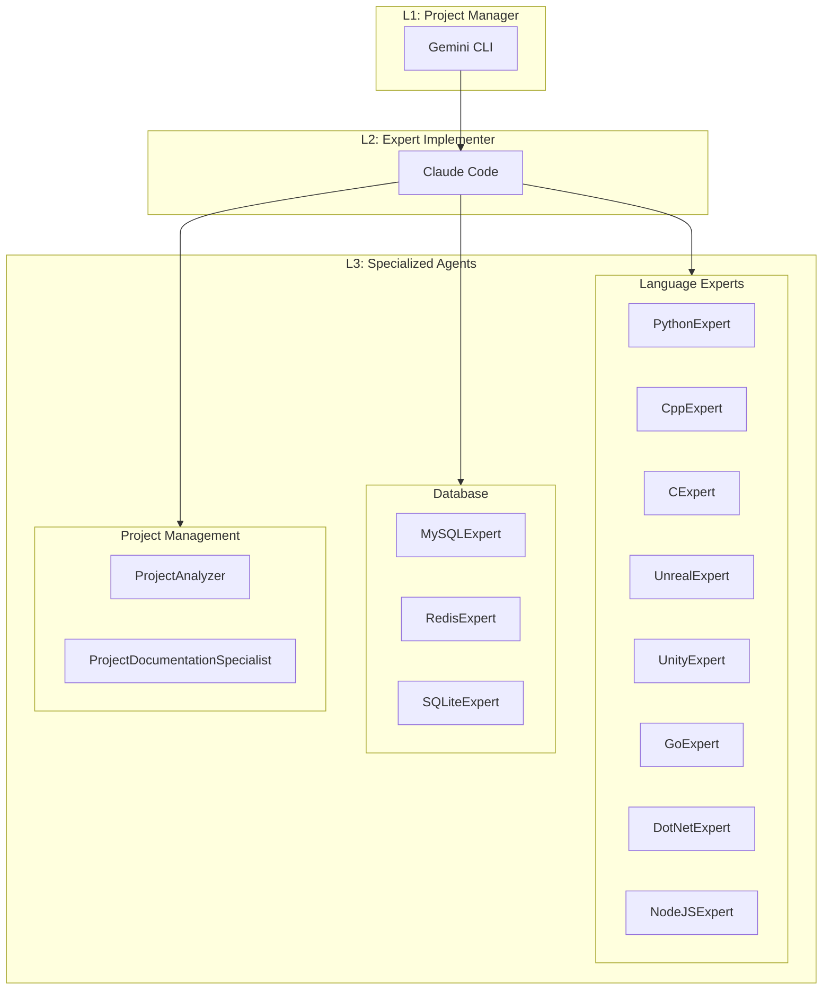

# 🤖 Gemini-Claude AI Collaboration Protocol

[](GEMINI.md)
[](./.kb/README.md)

**Two AIs working as one team for your projects.**

This repository defines an **open-source collaboration protocol** where **Gemini CLI** (strategist) and **Claude Code** (expert implementer) work together to develop software. Experience the process of transforming complex ideas into concrete code and bug reports into stable releases, and apply it directly to your projects.

## 🚀 Getting Started: Begin Your Project with an AI Team

Follow this guide to apply the AI collaboration protocol to your project and start your first task.

### Step 0: Prerequisites

This protocol uses CLI (Command Line Interface) tools from two AI agents. Before starting, ensure that each AI's CLI is installed and configured to run directly from the shell.

-   **Gemini CLI Installation:** [Installation Guide Link](https://github.com/google-gemini/gemini-cli)
-   **Claude Code Installation:** [Installation Guide Link](https://docs.anthropic.com/ko/docs/claude-code/quickstart)

### Step 1: Copy Protocol Files

Copy the core protocol files from this repository to your project's root directory.

-   `GEMINI.md`
-   `CLAUDE.md`
-   `.kb/` folder (entire folder)

> 💡 **Tip:** If you're curious about the complete structure of this repository, refer to the **'Project Architecture'** section right below.

### Step 2: Choose Your Starting Scenario

Now select the starting method that fits your situation and preferred work style.

#### Method 1: Start with Interactive Mode (Recommended for real-time communication and complex tasks)

Use this approach when you want to solve problems progressively through back-and-forth conversation with AI.

1.  **Launch Gemini Interactive Mode:** Enter the following command in your terminal to start a conversation with Gemini.
    ```bash
    gemini --interactive
    ```
2.  **Start Conversation:** Your terminal now becomes a chat interface. Enter your first instruction.
    ```
    Create an online chess game for me. Could you first propose the overall design and tech stack?
    ```
    Gemini will respond by setting up the project plan, creating necessary files, and guiding you through the next steps.

#### Method 2: Start with Non-Interactive (Command) Mode (Recommended for scripts and single tasks)

Use this when you want to execute a predefined single command and get immediate results.

**A) Start by instructing Gemini to create a plan:**

1.  **Create Request File (Bash command):**
    ```bash
    echo "Create an online chess game for me. Main features are 2-player matches, game record saving, and spectator mode." > my_request.md
    ```
2.  **Execute Gemini (Non-interactive):** Use the `-p` flag to instruct plan creation based on the file you just created.
    ```bash
    gemini -p "Based on the content in 'my_request.md' file, create a complete project plan and detailed specification (spec.md) in the '.kb/projects/chess-game/' folder." -y
    ```

**B) Start by instructing Claude to modify code:**

1.  **Create Sample File (Bash command):**
    ```bash
    echo "def calculate_sum(a, b):\n    return a + b" > utils.py
    ```
2.  **Execute Claude (Non-interactive):** Use the `-p` flag to directly instruct code modification.
    ```bash
    claude -p "Add logging functionality to the 'calculate_sum' function in the 'utils.py' file." --dangerously-skip-permissions
    ```

#### Method 3: Direct Claude Code Conversation Mode (Recommended for rapid prototyping and bug fixes)

Use this approach when you want to solve problems immediately through direct conversation with Claude.

1.  **Launch Claude Code Interactive Mode:** Start Claude Code from your terminal.
    ```bash
    claude
    ```
2.  **Give Immediate Task Instructions:** You can directly request specific tasks.
    ```
    Fix the NullPointerException error in the payment.py file. If needed, please consult with Gemini.
    ```
3.  **Automatic Collaboration:** When Claude deems it necessary, it will automatically request consultation from Gemini and provide an integrated final solution.

> 💡 **Advantages of Claude-led approach**: You can immediately start problem-solving without complex planning, and automatically leverage Gemini's expertise when needed.

---

## 🏛️ Project Architecture

> 💡 **Note:** This shows the complete file structure of this repository and the relationships between each protocol document and sample projects.

### 📊 Project Folder Structure



Depending on the nature of your project, you can choose between two main collaboration models.

### 🔄 Collaboration Workflow Diagram



### Scenario 1: Gemini-Led Workflow (Complex New Projects)

> **A model where the architect (Gemini) draws blueprints, and the expert contractor (Claude) builds the structure**

1.  **[User]** Conveys abstract ideas like "Build a real-time audio processing pipeline for a voice recognition assistant" to Gemini.
2.  **[Gemini 🧠]** Analyzes the idea and creates a detailed **task specification (`spec.md`)** in the `.kb` folder, including architecture, tech stack, folder structure, and class diagrams.
3.  **[User]** Reviews and approves the specification (blueprint) created by Gemini.
4.  **[Gemini 🧠]** Transfers the approved specification to Claude and instructs implementation.
5.  **[Claude ⚡]** Based on the specification, mobilizes internal **expert agent (Subagents)** teams (e.g., CppExpert, PythonExpert) to write actual code and save it as files. After all work is completed, **reports which experts were used**.

### 🤖 Subagents Expert System Architecture

Claude Code operates 13 internal expert systems to perform high-performance collaboration.



**Key Features:**
- **Hierarchical Structure**: L1(Planning) → L2(Coordination) → L3(Expert Execution)
- **Parallel Processing**: Maximizes efficiency by performing independent tasks simultaneously
- **Mandatory Reporting Upon Completion**: Claude **must report the Subagent details used** when all work is completed
6.  **[Gemini 🧠]** **Compiles, tests, and performs static analysis** on the code submitted by Claude to verify quality and provides final report to the user.

### Scenario 2: Claude-Led Workflow (Rapid Prototyping, Bug Fixes)

> **A model where the field technician (Claude) solves problems and consults with headquarters design team (Gemini) when necessary**

1.  **[User]** Gives Claude specific tasks like "There's a `NullPointerException` in the payment module. Please fix `Payment.java`".
2.  **[Claude ⚡]** Immediately starts code analysis and modification. If the root cause appears to be a deeper design flaw, stops work and requests consultation from Gemini.
3.  **[Gemini 🧠]** According to Claude's request, analyzes the root cause and writes a **solution proposal (`solution-proposal.md`)** in response.
4.  **[User]** Reviews Gemini's solution and approves the direction to proceed.
5.  **[Claude ⚡]** Finally modifies the code according to the approved solution, and after **self quality verification (build, regression testing)**, reports completion to the user.

---

## 🧑‍🤝‍🧑 Meet Our Team: Roles and Responsibilities (R&R)

| Role | 🧠 **Gemini CLI** (PM & Architect) | ⚡ **Claude Code** (Expert Implementer) |
| :--- | :--- | :--- |
| **Core Mission** | **"What and Why"** decisions | **"How"** implementation |
| **Main Responsibilities** | <ul><li>Requirements analysis and refinement</li><li>Architecture design and technical decisions</li><li>Work planning and detailed specification writing</li><li>Final deliverable integration and verification</li></ul> | <ul><li>Accurate code implementation based on specifications</li><li>**Coordination of 13 internal expert (Subagents) teams**</li><li>**Automated code quality verification (Lint, Build, Test)**</li><li>Alternative proposals and reporting in case of implementation failure</li></ul> |

## ⚙️ Dive Deeper: Our Unique Commitments

-   **File-based Communication:** Everything communicates through files. This is to transparently track all processes and clearly document the reasoning behind AI decisions.
-   **`.kb` Knowledge Base:** This is the project's 'brain' that records not only the simple deliverables (code) but also the process (why it was made that way). It contains error resolution processes, reasons for technical choices, and more.
-   **User-driven:** While AI is your most capable team member, you are always the captain of the project. Final decisions at all key stages are yours.
-   **Quality Assurance:** After writing code, Claude performs its own quality verification process including builds, linting, and testing to ensure stability.
-   **Hybrid File Modification Protocol:** Simple modifications (variable name changes, etc.) are immediately handled with `replace` commands, while complex modifications or `replace` failures use the **"Staged Write"** method by creating new files (`main_v2.cpp`) followed by verification and replacement.

## ⚠️ Important: Permissions and Configuration

-   **AI Agent Installation:** To use this protocol, both `gemini` and `claude` CLI tools must be installed and configured.
-   **Gemini → Claude calls (File write permissions):** When Gemini instructs Claude to create files, the command must include the `--dangerously-skip-permissions` flag for security reasons. This directly grants Claude file system access, so the purpose must always be clearly understood before use. (See `GEMINI.md` for details)
-   **Claude → Gemini calls (Auto-approval mode):** Conversely, when Claude requests analysis or consultation from Gemini, use the `-y` (YOLO mode) flag like `echo "..." | gemini -y` to prevent conversation interruption. This automatically approves all Gemini confirmation prompts to ensure smooth integration. (See `CLAUDE.md` for details)

---

We hope this protocol makes your development experience more creative and efficient. Feel free to fork this repository anytime to create your own AI collaboration approach!