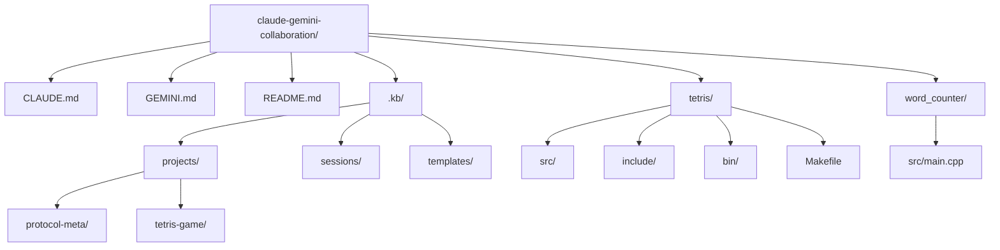
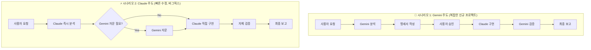
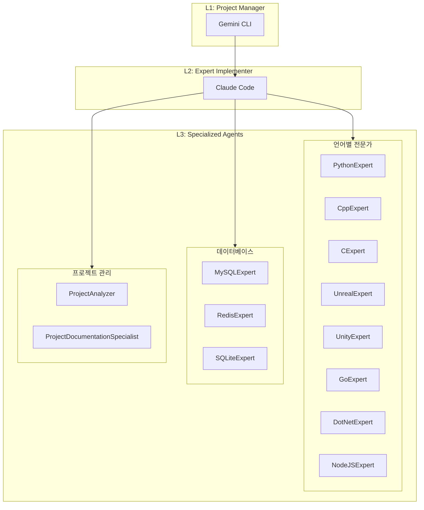

# 🤖 Gemini-Claude AI 협업 프로토콜

**두 AI가 하나의 팀처럼, 당신의 프로젝트를 위해 협업합니다.**

이 저장소는 **Gemini CLI** (전략가)와 **Claude Code** (전문 구현가)가 함께 일하며 소프트웨어를 개발하는 방법을 정의하는 **오픈소스 협업 프로토콜**입니다. 복잡한 아이디어를 구체적인 코드로, 버그 리포트를 안정적인 릴리즈로 만들어가는 과정을 직접 확인하고 당신의 프로젝트에 바로 적용해보세요.

## 🚀 시작하기: AI 팀과 함께 프로젝트 시작하기

이 가이드를 따라 당신의 프로젝트에 AI 협업 프로토콜을 적용하고 첫 작업을 시작해보세요.

### 0단계: 준비물

이 프로토콜은 두 AI 에이전트의 CLI(Command Line Interface) 도구를 사용합니다. 시작하기 전에 각 AI의 CLI가 설치되어 있고, 쉘(shell)에서 바로 실행할 수 있도록 설정되어 있어야 합니다.

-   **Gemini CLI 설치:** [설치 가이드 링크](https://github.com/google-gemini/gemini-cli)
-   **Claude Code 설치:** [설치 가이드 링크](https://docs.anthropic.com/ko/docs/claude-code/quickstart)

### 1단계: 프로토콜 파일 복사

이 저장소의 핵심 프로토콜 파일들을 당신의 프로젝트 루트 디렉토리로 복사합니다.

-   `GEMINI.md`
-   `CLAUDE.md`
-   `.kb/` 폴더 전체

> 💡 **팁:** 이 저장소의 전체 구조가 궁금하다면, 바로 아래의 **'프로젝트 아키텍처'** 섹션을 참고하세요.

### 2단계: 시작 시나리오 선택

이제 당신의 상황과 선호하는 작업 방식에 맞는 시작 방법을 선택하세요.

#### 방법 1: 대화형 모드로 시작하기 (실시간 소통 및 복잡한 작업에 추천)

AI와 대화를 주고받으며 점진적으로 문제를 해결하고 싶을 때 사용하는 방식입니다.

1.  **Gemini 대화형 모드 실행:** 터미널에 아래 명령어를 입력하여 Gemini와 대화를 시작합니다.
    ```bash
    gemini --interactive
    ```
2.  **대화 시작:** 이제부터는 터미널이 대화창이 됩니다. 첫 지시사항을 입력하세요.
    ```
    온라인 체스 게임을 만들어줘. 먼저 전체적인 설계와 기술 스택을 제안해줄래?
    ```
    Gemini가 응답하며 프로젝트 계획을 세우고, 필요한 파일을 생성하는 등 다음 단계를 안내할 것입니다.

#### 방법 2: 비대화형(명령어) 모드로 시작하기 (스크립트 및 단일 작업에 추천)

미리 정의된 단일 명령을 실행하고 결과를 바로 얻고 싶을 때 사용합니다.

**A) Gemini에게 계획 수립을 지시하며 시작:**

1.  **요청사항 파일 생성 (Bash 명령어):**
    ```bash
    echo "온라인 체스 게임을 만들어줘. 주요 기능은 2인 대전, 기보 저장, 관전 모드야." > my_request.md
    ```
2.  **Gemini 실행 (비대화형):** `-p` 플래그를 사용하여 방금 만든 파일을 기반으로 계획 수립을 지시합니다.
    ```bash
    gemini -p "'my_request.md' 파일의 내용을 바탕으로, '.kb/projects/chess-game/' 폴더에 전체 프로젝트 계획과 상세 명세서(spec.md)를 작성해줘." -y
    ```

**B) Claude에게 코드 수정을 지시하며 시작:**

1.  **샘플 파일 생성 (Bash 명령어):**
    ```bash
    echo "def calculate_sum(a, b):\n    return a + b" > utils.py
    ```
2.  **Claude 실행 (비대화형):** `-p` 플래그를 사용하여 코드 수정을 직접 지시합니다.
    ```bash
    claude -p "'utils.py' 파일의 'calculate_sum' 함수에 로깅 기능을 추가해줘." --dangerously-skip-permissions
    ```

#### 방법 3: Claude Code 직접 대화 모드 (빠른 프로토타이핑, 버그 수정에 추천)

Claude와 직접 대화하며 즉시 문제를 해결하고 싶을 때 사용하는 방식입니다.

1.  **Claude Code 대화형 모드 실행:** 터미널에서 Claude Code를 시작합니다.
    ```bash
    claude
    ```
2.  **즉시 작업 지시:** 구체적인 작업을 바로 요청할 수 있습니다.
    ```
    payment.py 파일에서 NullPointerException 에러를 수정해줘. 그리고 필요하면 Gemini에게 자문 요청해줘.
    ```
3.  **자동 협업:** Claude가 필요하다고 판단하면 자동으로 Gemini에게 자문을 요청하고, 결과를 통합하여 최종 솔루션을 제공합니다.

> 💡 **Claude 주도의 장점**: 복잡한 계획 수립 없이 즉시 문제 해결에 착수할 수 있으며, 필요시 자동으로 Gemini의 전문성을 활용합니다.

---

## 🏛️ 프로젝트 아키텍처

> 💡 **참고:** 이 저장소의 전체 파일 구조와 각 프로토콜 문서, 샘플 프로젝트의 관계를 보여줍니다.

### 📊 프로젝트 폴더 구조



프로젝트의 성격에 따라 두 가지 주요 협업 모델을 선택할 수 있습니다.

### 🔄 협업 워크플로우 다이어그램



### 시나리오 1: Gemini 주도 워크플로우 (복잡한 신규 프로젝트)

> **건축가(Gemini)가 청사진을 그리면, 전문 시공사(Claude)가 건물을 짓는 모델**

1.  **[사용자]** "음성인식 비서를 위한 실시간 오디오 처리 파이프라인을 구축해줘" 같이 추상적인 아이디어를 Gemini에게 전달합니다.
2.  **[Gemini 🧠]** 아이디어를 분석하여 아키텍처, 기술 스택, 폴더 구조, 클래스 다이어그램까지 포함된 상세한 **작업 명세서(`spec.md`)**를 `.kb` 폴더에 작성합니다.
3.  **[사용자]** Gemini가 만든 명세서(청사진)를 검토하고 승인합니다.
4.  **[Gemini 🧠]** 승인된 명세서를 Claude에게 전달하며 구현을 지시합니다.
5.  **[Claude ⚡]** 명세서를 기반으로, 내부의 **전문가 에이전트(Subagents)** 팀(예: CppExpert, PythonExpert)을 동원하여 실제 코드를 작성하고 파일로 저장합니다. 모든 작업이 끝나면 **어떤 전문가를 사용했는지 보고**합니다.

### 🤖 Subagents 전문가 시스템 아키텍처

Claude Code는 13개의 내부 전문가 시스템을 운영하여 고성능 협업을 수행합니다.



**주요 특징:**
- **계층적 구조**: L1(기획) → L2(조율) → L3(전문 실행)
- **병렬 처리**: 독립적인 작업을 동시에 수행하여 효율성 극대화
- **작업 완료 시 보고 의무**: Claude는 모든 작업 완료 시 **사용된 Subagent 내역을 반드시 보고**
6.  **[Gemini 🧠]** Claude가 제출한 코드를 **컴파일, 테스트, 정적 분석**하여 품질을 검증하고 사용자에게 최종 보고합니다.

### 시나리오 2: Claude 주도 워크플로우 (빠른 프로토타이핑, 버그 수정)

> **현장 기술자(Claude)가 문제를 해결하고, 필요시 본사의 설계팀(Gemini)에 자문을 구하는 모델**

1.  **[사용자]** "결제 모듈에서 `NullPointerException`이 발생하고 있어. `Payment.java`를 수정해줘" 같이 구체적인 작업을 Claude에게 지시합니다.
2.  **[Claude ⚡]** 즉시 코드 분석 및 수정에 착수합니다. 만약 문제의 원인이 더 깊은 설계 결함에 있다고 판단되면, 작업을 멈추고 Gemini에게 자문을 요청합니다.
3.  **[Gemini 🧠]** Claude의 요청에 따라 근본 원인을 분석하고, 해결을 위한 **솔루션 제안서(`solution-proposal.md`)**를 작성하여 회신합니다.
4.  **[사용자]** Gemini의 해결책을 검토하고 진행 방향을 승인합니다.
5.  **[Claude ⚡]** 승인된 해결책에 따라 최종적으로 코드를 수정하고, **자체 품질 검증(빌드, 회귀 테스트)**을 거쳐 사용자에게 완료 보고를 합니다.

---

## 🧑‍🤝‍🧑 우리 팀을 소개합니다: 역할과 책임 (R&R)

| 역할 | 🧠 **Gemini CLI** (PM & Architect) | ⚡ **Claude Code** (Expert Implementer) |
| :--- | :--- | :--- |
| **핵심 임무** | **"무엇을, 왜"** 결정 | **"어떻게"** 구현 |
| **주요 책임** | <ul><li>요구사항 분석 및 구체화</li><li>아키텍처 설계 및 기술 결정</li><li>작업 계획 및 상세 명세서 작성</li><li>최종 결과물 통합 및 검증</li></ul> | <ul><li>명세서 기반의 정확한 코드 구현</li><li>**13개의 내부 전문가(Subagents) 팀 조율**</li><li>**코드 품질 자동 검증 (Lint, Build, Test)**</li><li>구현 실패 시 대안 제시 및 보고</li></ul> |

## ⚙️ 더 깊이 알아보기: 우리만의 약속

-   **파일 기반 소통:** 모든 것은 파일로 이야기합니다. 이는 모든 과정을 투명하게 추적하고, AI가 내린 결정의 근거를 명확히 남기기 위함입니다.
-   **`.kb` 지식베이스:** 프로젝트의 단순 결과물(코드)뿐만 아니라, 그 과정(왜 그렇게 만들었는가)까지 모두 기록하는 프로젝트의 '뇌'입니다. 에러 해결 과정, 기술 선택의 이유 등이 모두 담깁니다.
-   **사용자 주도:** AI는 당신의 가장 유능한 팀원이지만, 프로젝트의 선장은 언제나 당신입니다. 모든 핵심 단계에서 최종 결정은 당신의 몫입니다.
-   **품질 보증:** Claude는 코드를 작성한 후, 자체적으로 빌드, 린팅, 테스트를 포함한 품질 검증 프로세스를 수행하여 안정성을 확보합니다.
-   **하이브리드 파일 수정 프로토콜:** 단순한 수정(변수명 변경 등)은 즉시 `replace` 명령어로 처리하고, 복잡한 수정이나 `replace` 실패 시에는 **"Staged Write(단계적 쓰기)"** 방식으로 새 파일(`main_v2.cpp`)을 생성 후 검증을 거쳐 교체합니다.

## ⚠️ 중요: 권한 및 설정

-   **AI 에이전트 설치:** 이 프로토콜을 사용하려면 `gemini`와 `claude` CLI 도구가 모두 설치 및 설정되어 있어야 합니다.
-   **Gemini → Claude 호출 시 (파일 쓰기 권한):** Gemini가 Claude에게 파일 생성을 지시할 때는, 보안상의 이유로 명령어에 `--dangerously-skip-permissions` 플래그를 포함해야 합니다. 이는 Claude에게 파일 시스템 접근 권한을 직접 부여하는 것이므로, 항상 그 목적을 명확히 인지하고 사용해야 합니다. (자세한 내용은 `GEMINI.md` 참조)
-   **Claude → Gemini 호출 시 (자동 승인 모드):** 반대로 Claude가 Gemini에게 분석이나 자문을 요청할 때는, 대화가 중단되지 않도록 `echo "..." | gemini -y` 와 같이 `-y` (YOLO 모드) 플래그를 사용해야 합니다. 이는 Gemini의 모든 확인 프롬프트를 자동으로 승인하여 원활한 연동을 보장합니다. (자세한 내용은 `CLAUDE.md` 참조)

---

이 프로토콜이 당신의 개발 경험을 더욱 창의적이고 효율적으로 만들길 바랍니다. 언제든 이 저장소를 포크하여 당신만의 AI 협업 방식을 만들어보세요!
