# Tetris V2: System Architecture Documentation

## Architecture Overview

Tetris V2 implements a clean, modular architecture that separates concerns across distinct system layers. The design follows modern C++ practices with clear interfaces, RAII resource management, and cross-platform compatibility.

### High-Level System Architecture

## Core Class Architecture

### Class Relationship Diagram

## Game State Management

### State Transition Diagram

## Game Loop Architecture

### Main Game Loop Flow

## Tetromino System Architecture

### Piece Type and Rotation System

```mermaid
graph LR
    subgraph "Tetromino Types"
        I[I-Piece<br/>Cyan<br/>Line]
        O[O-Piece<br/>Yellow<br/>Square]
        T[T-Piece<br/>Magenta<br/>T-Shape]
        S[S-Piece<br/>Green<br/>S-Shape]
        Z[Z-Piece<br/>Red<br/>Z-Shape]
        J[J-Piece<br/>Blue<br/>J-Shape]
        L[L-Piece<br/>Orange<br/>L-Shape]
    end
    
    subgraph "Rotation System"
        R0[Rotation 0°<br/>Base Position]
        R90[Rotation 90°<br/>Clockwise]
        R180[Rotation 180°<br/>Inverted]
        R270[Rotation 270°<br/>Counter-Clockwise]
        
        R0 --> R90
        R90 --> R180
        R180 --> R270
        R270 --> R0
    end
    
    subgraph "Wall Kick System"
        WK[Wall Kick Attempts]
        WK1[Try Original Position]
        WK2[Try Left Offset]
        WK3[Try Right Offset]
        WK4[Try Up Offset]
        
        WK --> WK1
        WK1 -->|Fail| WK2
        WK2 -->|Fail| WK3
        WK3 -->|Fail| WK4
        WK4 -->|Fail| Cancel[Cancel Rotation]
    end
    
    I --> R0
    O --> R0
    T --> R0
    S --> R0
    Z --> R0
    J --> R0
    L --> R0
```

## Collision Detection System

### Collision Detection Flow

## Rendering Pipeline

### Frame Rendering Architecture

## Memory Management Architecture

### Resource Lifecycle Management

## Cross-Platform Architecture

### Platform Abstraction Strategy

## Performance Optimization Architecture

### Frame Rate and Performance Management

## Architecture Principles

### Design Philosophy

1. **Separation of Concerns**: Each class has a single, well-defined responsibility
2. **Encapsulation**: Internal state is protected with clear public interfaces
3. **Resource Safety**: RAII principles ensure automatic resource management
4. **Performance**: Optimized for 60 FPS gameplay with minimal allocations
5. **Maintainability**: Clear code structure enables easy modification and extension
6. **Cross-Platform**: Single codebase works across Windows and Linux

### Architectural Benefits

- **Modularity**: Components can be modified independently
- **Testability**: Clear interfaces enable unit testing
- **Extensibility**: New features can be added without major refactoring
- **Performance**: Optimized data structures and algorithms
- **Reliability**: Robust error handling and resource management
- **Portability**: Platform-independent core with abstracted dependencies

This architecture provides a solid foundation for a production-quality Tetris implementation while serving as an excellent reference for modern C++ game development practices and AI collaboration methodologies.