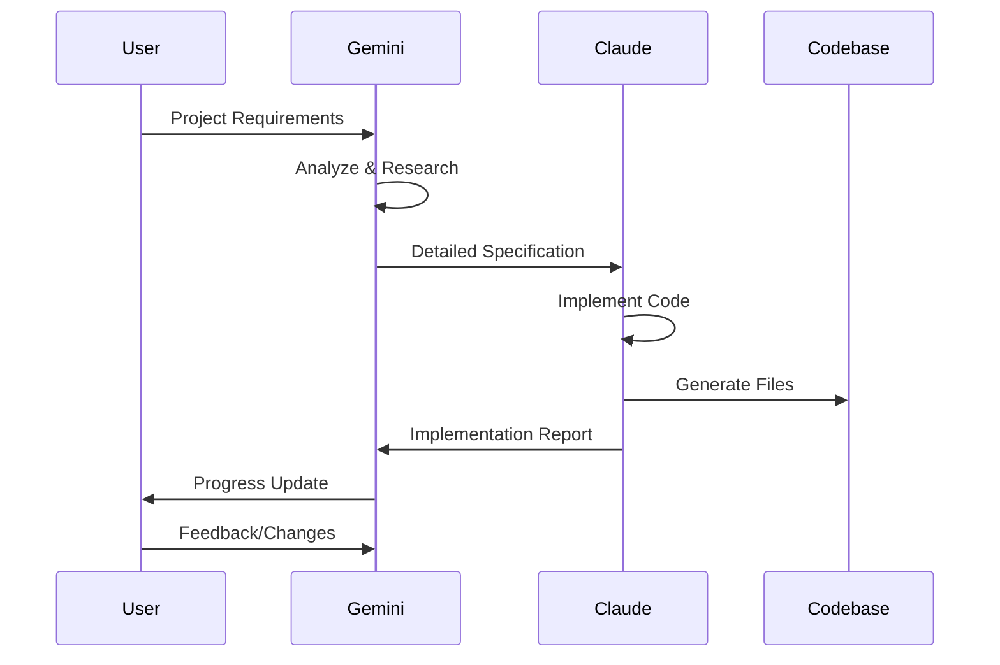

# Tetris V2: Development Guide

## Introduction

This guide provides comprehensive information for developers who want to contribute to, modify, or extend the Tetris V2 project. It covers development environment setup, code organization principles, contribution workflows, and AI collaboration methodologies.

## Quick Start for Developers

### 1. Environment Setup

#### Prerequisites Checklist
- [ ] **C++17 Compatible Compiler** (GCC 7+, Clang 5+, MSVC 2017+)
- [ ] **CMake 3.10+** for build system management
- [ ] **SFML 2.5+** for graphics and windowing
- [ ] **Git** for version control
- [ ] **Code Editor/IDE** with C++ support (VS Code, Visual Studio, CLion)

#### Development Environment Configuration

**Windows (Visual Studio):**
```cmd
# Install Visual Studio 2019+ with C++ workload
# Install CMake Tools extension
# Configure vcpkg for dependency management
git clone https://github.com/Microsoft/vcpkg.git
vcpkg install sfml:x64-windows
```

**Linux (Any Editor):**
```bash
# Ubuntu/Debian
sudo apt install cmake g++ libsfml-dev gdb

# Fedora
sudo dnf install cmake gcc-c++ SFML-devel gdb

# Development tools
sudo apt install valgrind  # Memory debugging
sudo apt install clang-format  # Code formatting
```

### 2. Project Setup

```bash
# Clone repository
git clone <repository-url>
cd tetris_v2

# Create development build
mkdir build-dev && cd build-dev
cmake .. -DCMAKE_BUILD_TYPE=Debug
make -j$(nproc)  # Linux
# or cmake --build . --config Debug  # Windows

# Run with debugging symbols
gdb ./tetris_v2  # Linux
# or debug in Visual Studio  # Windows
```

## Code Architecture Deep Dive

### Directory Structure Philosophy

```
tetris_v2/
├── include/TetrisV2/          # Public interfaces
│   ├── Constants.h            # Game configuration constants
│   ├── Game.h                # Main game engine interface
│   ├── Board.h               # Game board logic interface
│   ├── Tetromino.h           # Piece logic interface
│   └── Renderer.h            # Rendering system interface
├── src/                       # Implementation files
│   ├── main.cpp              # Entry point
│   ├── Game.cpp              # Game engine implementation
│   ├── Board.cpp             # Board logic implementation
│   ├── Tetromino.cpp         # Piece logic implementation
│   └── Renderer.cpp          # Rendering implementation
├── assets/                    # Game resources
│   ├── fonts/                # Font files
│   └── sounds/               # Audio files (future)
├── build/                     # Build artifacts (generated)
├── CMakeLists.txt            # Build configuration
└── README.md                 # User documentation
```

### Code Organization Principles

#### 1. Header-Implementation Separation
```cpp
// include/TetrisV2/Game.h - Interface only
class Game {
public:
    void run();  // Public interface
private:
    void processInput();  // Private implementation detail
};

// src/Game.cpp - Implementation details
void Game::processInput() {
    // Implementation hidden from clients
}
```

#### 2. Namespace Organization
```cpp
namespace TetrisV2 {
    // All project code in dedicated namespace
    // Prevents naming conflicts
    // Clear project identity
}
```

#### 3. Const-Correctness
```cpp
// Immutable data clearly marked
const std::vector<sf::Vector2i>& getBlocks() const;

// Member functions that don't modify state
bool isCollision(const Tetromino& tetromino) const;
```

## Code Style and Standards

### 1. Naming Conventions

```cpp
// Classes: PascalCase
class GameBoard { };

// Member variables: m_ prefix + camelCase
class Game {
private:
    sf::RenderWindow m_window;
    int m_score;
};

// Functions: camelCase
void processInput();
bool tryMovePiece(int dx, int dy);

// Constants: UPPER_SNAKE_CASE
constexpr int BOARD_WIDTH = 10;

// Enums: PascalCase with scoped enum
enum class TetrominoType { I, O, T, S, Z, J, L };
```

### 2. Documentation Standards

#### Doxygen-Style Comments
```cpp
/**
 * @brief Attempts to move the current piece by specified offset
 * @param dx Horizontal movement (-1 for left, +1 for right)
 * @param dy Vertical movement (+1 for down)
 * @return true if move was successful, false if blocked by collision
 * 
 * This function checks for collisions before moving and only updates
 * the piece position if the move is valid. Wall kick logic is not
 * applied here - see tryRotatePiece() for rotation with wall kicks.
 */
bool tryMovePiece(int dx, int dy);
```

#### Inline Comments
```cpp
// Calculate drop time based on level (gets faster each level)
float dropTime = INITIAL_DROP_TIME - (m_level * DROP_TIME_DECREASE);

// Clamp to minimum drop time to prevent impossible speeds
dropTime = std::max(dropTime, 0.05f);
```

### 3. Error Handling Patterns

```cpp
// Use std::optional for optional values
std::optional<Tetromino> m_currentPiece;

// Check validity before use
if (m_currentPiece.has_value()) {
    m_renderer.drawTetromino(m_currentPiece.value());
}

// Early return for error conditions
bool Board::isValidPosition(int x, int y) const {
    if (x < 0 || x >= BOARD_WIDTH) return false;
    if (y < 0 || y >= BOARD_HEIGHT) return false;
    return true;
}
```

## Feature Development Workflow

### 1. Planning Phase

#### Feature Definition Template
```markdown
## Feature: [Feature Name]

### Description
Brief description of the feature and its purpose.

### Requirements
- [ ] Functional requirement 1
- [ ] Functional requirement 2
- [ ] Performance requirement
- [ ] Compatibility requirement

### Design Considerations
- Interface changes needed
- Performance implications
- Testing strategy

### Implementation Plan
1. Step 1: Interface definition
2. Step 2: Core logic implementation
3. Step 3: Integration with existing systems
4. Step 4: Testing and validation
```

#### Architecture Decision Template
```markdown
## ADR: [Decision Title]

### Status
Proposed | Accepted | Rejected | Superseded

### Context
What is the issue that we're seeing that is motivating this decision?

### Decision
What is the change that we're proposing or have agreed to implement?

### Consequences
What becomes easier or more difficult to do and any risks introduced?
```

### 2. Implementation Phase

#### Branch Strategy
```bash
# Feature development branch
git checkout -b feature/sound-system
git checkout -b bugfix/collision-detection
git checkout -b refactor/renderer-optimization

# Regular commits with clear messages
git commit -m "feat: Add sound effect loading system"
git commit -m "fix: Correct wall collision detection near borders"
git commit -m "refactor: Optimize renderer batch operations"
```

#### Code Review Checklist
- [ ] **Functionality**: Feature works as specified
- [ ] **Code Quality**: Follows project coding standards
- [ ] **Performance**: No performance regressions
- [ ] **Documentation**: Code is properly documented
- [ ] **Testing**: Adequate test coverage
- [ ] **Cross-Platform**: Works on Windows and Linux
- [ ] **Memory Safety**: No memory leaks or undefined behavior

### 3. Testing Strategy

#### Unit Testing Framework Setup
```cpp
// Example unit test structure (if adding testing)
#include <gtest/gtest.h>
#include "TetrisV2/Board.h"

TEST(BoardTest, EmptyBoardHasNoCollisions) {
    TetrisV2::Board board;
    TetrisV2::Tetromino piece(TetrisV2::TetrominoType::I);
    
    EXPECT_FALSE(board.isCollision(piece));
}

TEST(BoardTest, CollisionDetectedAtBoardBottom) {
    TetrisV2::Board board;
    TetrisV2::Tetromino piece(TetrisV2::TetrominoType::I);
    piece.setPosition({0, BOARD_HEIGHT});  // Below board
    
    EXPECT_TRUE(board.isCollision(piece));
}
```

#### Manual Testing Checklist
- [ ] **Core Gameplay**: All Tetris rules work correctly
- [ ] **Input Handling**: All controls responsive and accurate
- [ ] **Visual Quality**: Rendering is correct and smooth
- [ ] **Performance**: Maintains 60 FPS during gameplay
- [ ] **Edge Cases**: Handles boundary conditions gracefully
- [ ] **Platform Compatibility**: Works on target platforms

## AI Collaboration Methodology

### Gemini-Claude Collaboration Pattern

This project demonstrates the **Specification-Driven AI Collaboration** pattern:



### 1. Specification-Driven Development

#### Gemini's Role (Architect/Planner)
- **Requirements Analysis**: Break down user requests into technical specifications
- **Technology Research**: Investigate best practices and technology choices
- **Architecture Design**: Create high-level system design and component interfaces
- **Specification Writing**: Produce detailed implementation specifications

#### Claude's Role (Implementer/Executor)
- **Code Implementation**: Write actual C++ code following specifications
- **File Management**: Create, modify, and organize project files
- **Build System**: Configure CMake and build processes
- **Quality Assurance**: Ensure code quality and cross-platform compatibility

### 2. Documentation-First Approach

#### Knowledge Base Structure
```
.kb/projects/tetris_v2/
├── project-overview.md     # High-level project description
├── spec.md                # Technical implementation specification
├── architecture.md        # System architecture with diagrams
├── deployment-guide.md    # Platform-specific deployment
├── development-guide.md   # This document
└── design/               # Visual design artifacts
```

#### Collaboration Artifacts
- **Specifications**: Clear, detailed technical requirements
- **Architecture Diagrams**: Visual system design using Mermaid
- **Decision Records**: Important technical decisions documented
- **Session Logs**: Record of AI collaboration process

### 3. Quality Assurance in AI Collaboration

#### Specification Quality Gates
- [ ] **Completeness**: All requirements covered
- [ ] **Clarity**: Unambiguous implementation instructions
- [ ] **Testability**: Clear success criteria defined
- [ ] **Platform Coverage**: Windows and Linux considerations

#### Implementation Quality Gates
- [ ] **Specification Compliance**: Implementation matches spec
- [ ] **Code Quality**: Follows project coding standards
- [ ] **Documentation**: Adequate inline and external documentation
- [ ] **Cross-Platform**: Builds and runs on target platforms

## Advanced Development Topics

### 1. Performance Optimization

#### Profiling and Measurement
```cpp
// Performance measurement example
class PerformanceTimer {
    sf::Clock m_clock;
public:
    void start() { m_clock.restart(); }
    float getElapsed() { return m_clock.getElapsedTime().asSeconds(); }
};

// Usage in game loop
PerformanceTimer timer;
timer.start();
update(deltaTime);
float updateTime = timer.getElapsed();
if (updateTime > 0.016f) {  // 60 FPS threshold
    // Log performance warning
}
```

#### Memory Optimization
```cpp
// Prefer stack allocation
Tetromino piece(TetrominoType::I);  // Stack allocated

// Use move semantics for efficiency
std::vector<sf::Vector2i> blocks = piece.getBlocks();  // Copy
std::vector<sf::Vector2i> blocks = std::move(piece.getBlocks());  // Move

// Reserve vector capacity to avoid reallocations
std::vector<sf::Color> colors;
colors.reserve(BOARD_WIDTH * BOARD_HEIGHT);
```

### 2. Extensibility Patterns

#### Plugin Architecture Example
```cpp
// Abstract interface for game modes
class GameMode {
public:
    virtual ~GameMode() = default;
    virtual void update(float deltaTime) = 0;
    virtual void render(Renderer& renderer) = 0;
    virtual bool isGameOver() const = 0;
};

// Classic Tetris implementation
class ClassicMode : public GameMode {
    // Implementation specific to classic rules
};

// Future: Sprint mode, puzzle mode, etc.
class SprintMode : public GameMode {
    // Implementation for time-based challenges
};
```

#### Configuration System
```cpp
// Centralized configuration
class GameConfig {
public:
    static GameConfig& instance();
    
    // Configurable parameters
    int getBoardWidth() const { return m_boardWidth; }
    float getInitialDropTime() const { return m_initialDropTime; }
    sf::Color getBackgroundColor() const { return m_backgroundColor; }
    
private:
    int m_boardWidth = 10;
    float m_initialDropTime = 1.0f;
    sf::Color m_backgroundColor = sf::Color::Black;
};
```

### 3. Cross-Platform Considerations

#### Platform-Specific Code Patterns
```cpp
// Platform detection
#ifdef _WIN32
    // Windows-specific code
    #include <windows.h>
    std::string getSystemFont() {
        return "C:/Windows/Fonts/arial.ttf";
    }
#elif __linux__
    // Linux-specific code
    #include <unistd.h>
    std::string getSystemFont() {
        return "/usr/share/fonts/truetype/liberation/LiberationSans-Regular.ttf";
    }
#endif

// Cross-platform file paths
std::filesystem::path getAssetPath(const std::string& filename) {
    return std::filesystem::current_path() / "assets" / filename;
}
```

#### Build System Extensions
```cmake
# Platform-specific compiler flags
if(MSVC)
    target_compile_options(tetris_v2 PRIVATE /W4)
else()
    target_compile_options(tetris_v2 PRIVATE -Wall -Wextra -Wpedantic)
endif()

# Debug vs Release configurations
if(CMAKE_BUILD_TYPE STREQUAL "Debug")
    target_compile_definitions(tetris_v2 PRIVATE DEBUG_MODE)
endif()
```

## Contribution Guidelines

### 1. Code Contribution Process

1. **Fork and Clone**
   ```bash
   git clone <your-fork-url>
   cd tetris_v2
   git remote add upstream <original-repo-url>
   ```

2. **Create Feature Branch**
   ```bash
   git checkout -b feature/your-feature-name
   ```

3. **Develop and Test**
   ```bash
   # Make changes
   # Test on both platforms if possible
   # Add documentation
   ```

4. **Commit with Clear Messages**
   ```bash
   git commit -m "feat: Add multiplayer support"
   git commit -m "fix: Resolve rotation collision bug"
   git commit -m "docs: Update API documentation"
   ```

5. **Submit Pull Request**
   - Clear description of changes
   - Reference any related issues
   - Include testing information
   - Ensure CI passes

### 2. Documentation Contributions

- **Code Comments**: Follow Doxygen standards
- **Architecture Changes**: Update relevant diagrams
- **New Features**: Add to user documentation
- **API Changes**: Update interface documentation

### 3. Issue Reporting

```markdown
## Bug Report Template

### Description
Brief description of the issue

### Steps to Reproduce
1. Step 1
2. Step 2
3. Step 3

### Expected Behavior
What should happen

### Actual Behavior
What actually happens

### Environment
- OS: Windows 10 / Ubuntu 20.04
- Compiler: MSVC 2019 / GCC 9
- SFML Version: 2.5.1
- Build Type: Debug / Release

### Additional Context
Any other relevant information
```

## Future Development Roadmap

### Short-Term Enhancements
- [ ] **Sound System**: Audio effects and background music
- [ ] **Visual Effects**: Particle systems and animations
- [ ] **Game Modes**: Sprint, Marathon, Puzzle modes
- [ ] **High Scores**: Persistent score tracking

### Medium-Term Features
- [ ] **Multiplayer**: Local and network multiplayer
- [ ] **Customization**: Themes, controls, and gameplay tweaks
- [ ] **Mobile Support**: Android and iOS ports
- [ ] **Mod Support**: Plugin system for community content

### Long-Term Vision
- [ ] **AI Players**: Computer opponents with difficulty levels
- [ ] **Tournament System**: Competitive play infrastructure
- [ ] **VR Support**: Virtual reality gaming experience
- [ ] **Cloud Integration**: Cross-device progress synchronization

This development guide provides the foundation for maintaining high code quality while enabling collaborative development between human developers and AI systems. The established patterns and practices ensure consistency and reliability across all contributions to the project.