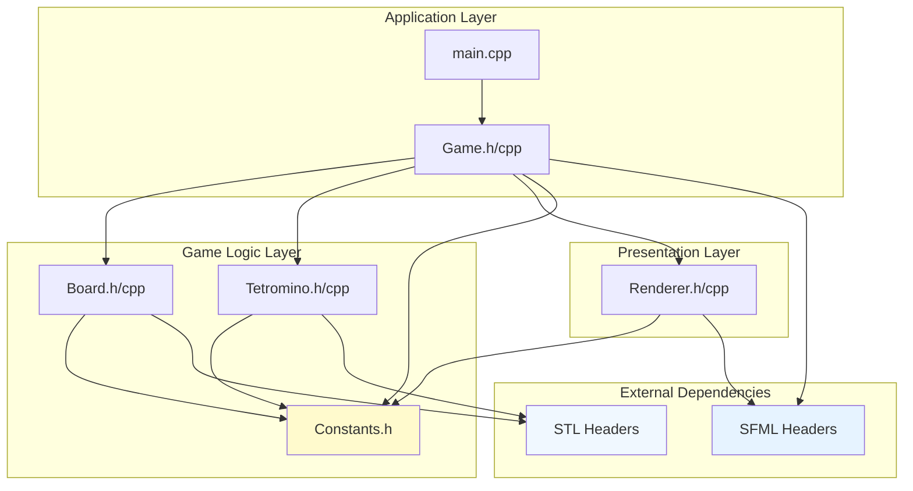
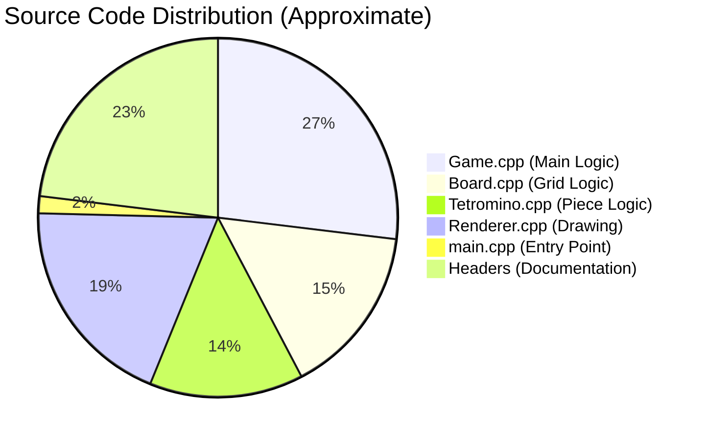
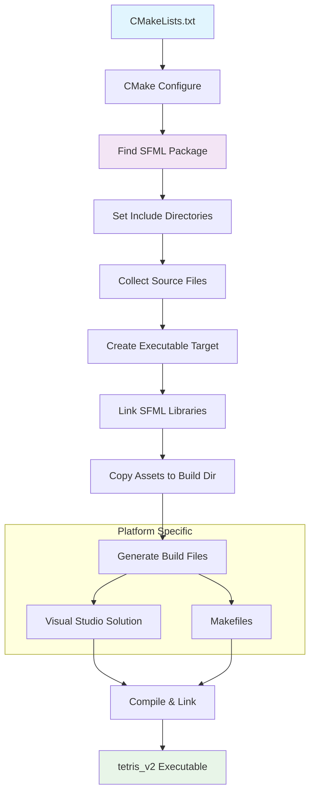
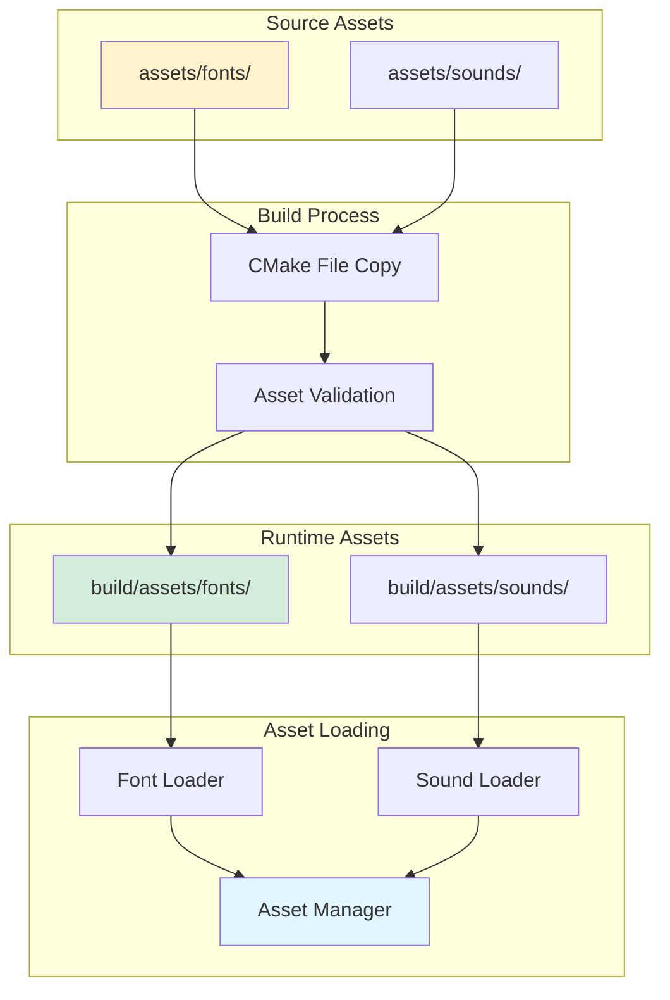
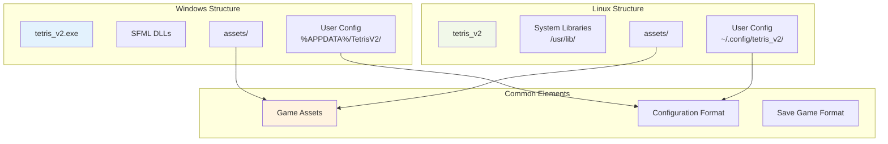
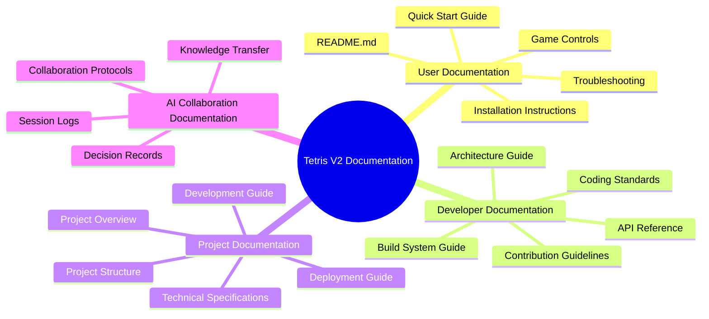
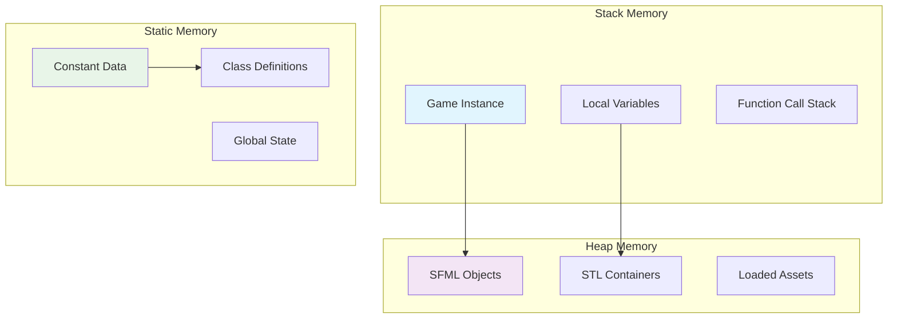

# Tetris V2: Project Structure Documentation

## Complete Project Structure Overview

This document provides a comprehensive visual representation of the Tetris V2 project structure, file organization, and relationships between different components.

### Root Directory Structure

```
tetris_v2/
├── 📁 assets/                     # Game assets and resources
│   ├── 📁 fonts/                 # Font files for text rendering
│   │   ├── 📄 README.md          # Font usage documentation
│   │   └── 📄 arial.ttf          # Primary game font (if available)
│   └── 📁 sounds/                # Audio files (future expansion)
│       ├── 📄 README.md          # Sound documentation
│       ├── 🔊 clear.wav          # Line clear sound effect (planned)
│       └── 🔊 gameover.wav       # Game over sound effect (planned)
├── 📁 include/TetrisV2/          # Public header files
│   ├── 📄 Board.h               # Game board interface
│   ├── 📄 Constants.h           # Game configuration constants
│   ├── 📄 Game.h                # Main game engine interface
│   ├── 📄 Renderer.h            # Rendering system interface
│   └── 📄 Tetromino.h           # Tetris piece interface
├── 📁 src/                       # Implementation source files
│   ├── 📄 Board.cpp             # Game board implementation
│   ├── 📄 Game.cpp              # Main game engine implementation
│   ├── 📄 main.cpp              # Application entry point
│   ├── 📄 Renderer.cpp          # Rendering system implementation
│   └── 📄 Tetromino.cpp         # Tetris piece implementation
├── 📁 build/                     # CMake build directory (generated)
│   ├── 📁 Debug/                # Debug build artifacts
│   ├── 📁 Release/              # Release build artifacts
│   ├── 📁 assets/               # Copied asset files
│   └── ⚙️ CMakeCache.txt        # CMake configuration cache
├── 📄 CMakeLists.txt            # Cross-platform build configuration
├── 📄 README.md                 # User documentation and setup guide
├── 📄 .gitignore               # Git ignore patterns
└── 📄 LICENSE                   # Project license (if applicable)
```

### Knowledge Base Integration

```
.kb/projects/tetris_v2/           # Project knowledge base
├── 📄 project-overview.md       # Comprehensive project description
├── 📄 spec.md                   # Technical implementation specification
├── 📄 architecture.md           # System architecture with diagrams
├── 📄 deployment-guide.md       # Platform deployment instructions
├── 📄 development-guide.md      # Developer contribution guide
├── 📄 project-structure.md      # This document
├── 📁 adr/                      # Architecture Decision Records
│   └── 📄 ADR-001-sfml-choice.md
├── 📁 design/                   # Design documents and diagrams
│   ├── 📄 class-diagrams.md    # UML class relationships
│   ├── 📄 game-flow.md         # Game state flow documentation
│   └── 📄 visual-design.md     # UI/UX design specifications
└── 📁 sessions/                 # Development session logs
    └── 📁 2024-08-18-initial-implementation/
        ├── 📄 session-log.md
        └── 📄 collaboration-notes.md
```

## File Dependencies and Relationships

### Header Dependency Graph



### Include Hierarchy Visualization

```
Constants.h (Base Level)
├── Used by: Board.h
├── Used by: Tetromino.h
├── Used by: Renderer.h
└── Used by: Game.h

Board.h (Game Logic)
├── Includes: Constants.h
├── Includes: <SFML/Graphics.hpp>
├── Includes: <vector>
└── Used by: Game.h

Tetromino.h (Game Logic)
├── Includes: Constants.h
├── Includes: <SFML/Graphics.hpp>
├── Includes: <vector>
└── Used by: Game.h

Renderer.h (Presentation)
├── Includes: Constants.h
├── Includes: Board.h
├── Includes: Tetromino.h
├── Includes: <SFML/Graphics.hpp>
└── Used by: Game.h

Game.h (Application)
├── Includes: Constants.h
├── Includes: Board.h
├── Includes: Tetromino.h
├── Includes: Renderer.h
├── Includes: <SFML/Graphics.hpp>
├── Includes: <random>
├── Includes: <optional>
└── Used by: main.cpp
```

## Component Size and Complexity Analysis

### Lines of Code Distribution



### Component Responsibility Matrix

| Component | Primary Responsibility | Secondary Responsibility | Complexity |
|-----------|----------------------|-------------------------|------------|
| **main.cpp** | Application bootstrap | Exception handling | Low |
| **Game.h/cpp** | Game loop coordination | State management | High |
| **Board.h/cpp** | Grid state management | Collision detection | Medium |
| **Tetromino.h/cpp** | Piece representation | Rotation logic | Medium |
| **Renderer.h/cpp** | Graphics rendering | UI presentation | Medium |
| **Constants.h** | Configuration values | Type definitions | Low |

## Build System Architecture

### CMake Build Flow



### Build Artifact Organization

```
build/                            # CMake build directory
├── 📁 CMakeFiles/               # CMake internal files
│   ├── 📁 3.22.1/              # CMake version specific
│   ├── 📁 tetris_v2.dir/       # Target specific build files
│   └── ⚙️ Makefile              # Generated Makefile (Linux)
├── 📁 Debug/                    # Debug configuration (Windows)
│   ├── 🎮 tetris_v2.exe       # Debug executable
│   └── 📄 tetris_v2.pdb       # Debug symbols
├── 📁 Release/                  # Release configuration (Windows)
│   ├── 🎮 tetris_v2.exe       # Optimized executable
│   └── 📄 *.dll               # SFML runtime libraries
├── 📁 assets/                   # Copied game assets
│   ├── 📁 fonts/
│   └── 📁 sounds/
├── 🎮 tetris_v2                # Linux executable
├── ⚙️ CMakeCache.txt           # CMake configuration cache
├── ⚙️ Makefile                 # Top-level Makefile (Linux)
└── 🔧 compile_commands.json    # Compilation database
```

## Asset Management Structure

### Asset Organization Strategy



### Asset Loading Strategy

```cpp
// Asset path resolution strategy
namespace TetrisV2 {
    class AssetManager {
    public:
        static std::string getAssetPath(const std::string& category, 
                                       const std::string& filename) {
            // Check relative to executable first
            std::string relativePath = "assets/" + category + "/" + filename;
            if (std::filesystem::exists(relativePath)) {
                return relativePath;
            }
            
            // Check system paths as fallback
            std::vector<std::string> systemPaths = {
                "/usr/share/tetris_v2/assets/" + category + "/",
                "/usr/local/share/tetris_v2/assets/" + category + "/",
                "C:/Program Files/TetrisV2/assets/" + category + "/"
            };
            
            for (const auto& path : systemPaths) {
                std::string fullPath = path + filename;
                if (std::filesystem::exists(fullPath)) {
                    return fullPath;
                }
            }
            
            return "";  // Asset not found
        }
    };
}
```

## Cross-Platform File Structure

### Platform-Specific Considerations



## Documentation Structure Integration

### Documentation Ecosystem



### Documentation Cross-References

| Document | References | Referenced By |
|----------|------------|---------------|
| **project-overview.md** | spec.md, architecture.md | All other docs |
| **spec.md** | Constants.h, CMakeLists.txt | development-guide.md |
| **architecture.md** | All header files | deployment-guide.md |
| **deployment-guide.md** | CMakeLists.txt, README.md | development-guide.md |
| **development-guide.md** | All source files | Future contributors |
| **project-structure.md** | All project files | New team members |

## Version Control Structure

### Git Repository Organization

```
.git/                             # Git repository metadata
├── 📁 hooks/                    # Git hooks for automation
├── 📁 objects/                  # Git object database
├── 📁 refs/                     # Git references
└── ⚙️ config                    # Repository configuration

.gitignore                        # Git ignore patterns
├── build/                       # Ignore build artifacts
├── *.user                       # Ignore IDE user files
├── .vs/                         # Ignore Visual Studio temp files
├── CMakeCache.txt               # Ignore CMake cache
└── *.exe                        # Ignore executables

README.md                         # Primary project documentation
├── Project description
├── Build instructions
├── Usage examples
└── License information
```

### Branch Strategy Visualization

```mermaid
gitgraph
    commit id: "Initial commit"
    commit id: "Add CMake config"
    commit id: "Implement basic structure"
    
    branch feature/game-logic
    checkout feature/game-logic
    commit id: "Add Board class"
    commit id: "Add Tetromino class"
    commit id: "Implement collision detection"
    
    checkout main
    merge feature/game-logic
    commit id: "Merge game logic"
    
    branch feature/rendering
    checkout feature/rendering
    commit id: "Add Renderer class"
    commit id: "Implement SFML integration"
    
    checkout main
    merge feature/rendering
    commit id: "Merge rendering system"
    
    commit id: "Add documentation"
    commit id: "Release v1.0"
```

## Memory Layout and Performance Structure

### Runtime Memory Organization



This comprehensive project structure documentation provides a complete visual and textual representation of how the Tetris V2 project is organized, making it easy for new developers, AI systems, and project stakeholders to understand the codebase organization and architectural decisions.